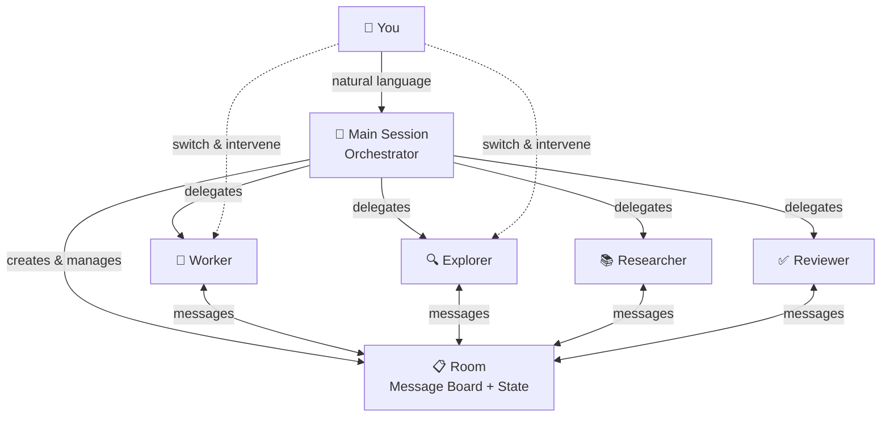

# pi-crew

**Multi-agent collaboration, fully in sight.**

[中文文档](README_ZH.md)

pi-crew is a multi-agent orchestration extension purpose-built for [Paseo](https://github.com/getpaseo/paseo) + [pi](https://github.com/earendil-works/pi). It's not another "let AIs talk to each other" framework — it's a coordination hub that lets you see, take over, and intervene in any subagent's workflow at any moment.

---

## Why pi-crew?

### Every subagent works in plain sight

Unlike other multi-agent solutions that hide subtasks in a black box, each pi-crew subagent runs as an **independent Paseo session**. You can switch to any subagent's workspace in the Paseo UI and watch its reasoning, tool calls, and file operations — **as if you're sitting right next to it**.

### Human-in-the-loop, always

Spot a problem? Take over directly. Subagent stuck? Jump in with a command. Heading the wrong way? Correct it on the spot. pi-crew doesn't assume AI can work perfectly on its own — it assumes you're the decision-maker, and AI is your high-bandwidth team of assistants.

### Transparent collaboration

Every coordination message — task assignments, completions, dependency triggers — lives on a shared message board. Not a log file, but a **living conversation record**. Rewind any interaction at any moment to understand why each agent did what it did.



> 🧹 **Session-scoped lifecycle**: when the main session closes, all sub-agents and their git worktrees are automatically cleaned up. No leftovers.
>
> 💻 **Standalone mode**: pi-crew also works without Paseo — just pi alone. You lose the ability to directly view and interact with sub-agents, but all orchestration features work exactly the same.

---

## How pi-crew Compares

| | pi-crew | Claude Code Teams | AutoGen | CrewAI |
|---|---|---|---|---|
| **Subagent visibility** | ✅ Live in Paseo UI | ❌ Terminal cycling | ❌ Code-level tracing | ❌ Logs only |
| **Human-in-the-loop** | ✅ Intervene in any subagent | ⚠️ Lead-only interaction | ❌ Code intervention | ❌ Code intervention |
| **Git isolation** | ✅ Per-worker worktree | ❌ Shared files, conflict risk | N/A | N/A |
| **Task dependencies** | ✅ `{input:#N}` declarative | ⚠️ Shared task list | Configurable | Sequential/hierarchical |
| **Crash recovery** | ✅ Heartbeat + watchdog | ❌ No session resume | ⚠️ Checkpoints | Limited |
| **Custom agents** | ✅ One YAML file | ⚠️ Subagent definitions | Requires code | Requires code |
| **Best for** | Coding, review, research | Exploratory tasks | Research experiments | Role-play pipelines |

**pi-crew isn't just "another multi-agent framework"** — it's a control panel for managing AI assistants in Paseo the way you'd manage a team.

https://github.com/user-attachments/assets/9402942a-4b91-4936-82ef-e122d18623be

https://github.com/user-attachments/assets/1c6a8520-812c-4f67-ad9f-8d6e3c1be9f6

---

## Quick Start

### Install

```bash
pi install git:https://github.com/thaning0/pi-crew.git
```

Zero config, zero external services, zero database. Works on Linux and macOS.

### Your First Team

Just tell pi what you need — the orchestrator handles the rest:

> *"Investigate how JWT + OAuth should be implemented in this project, create a plan, and implement it."*

pi-crew automatically spawns a researcher to gather context, a planner to design the approach, and a worker to write the code — each running as its own Paseo session you can watch and intervene in at any time.

### Code Review on Autopilot

> *"Review src/auth for security issues and code quality, have the fixes applied, then review again."*

pi-crew runs the full implement-review loop: write → review → revise → review, up to 3 rounds, until reviewers approve.

### Parallel Feature Development

> *"Build the login page UI, the login API endpoint, and integration tests — all three in parallel."*

Three workers start simultaneously, each in its own isolated git worktree. No conflicts. Results aggregated when all finish.

### Dependency Chains

> *"Research the authentication landscape first, then design the architecture based on that research, then implement it."*

pi-crew chains tasks automatically — each downstream task waits for its upstream to complete before starting. No manual handoff required.

---

## Built-in Agents

| Agent | Best at | Worktree Isolated |
|-------|--------|:---:|
| `explorer` | Fast codebase & web exploration | |
| `worker` | General coding, isolated git branch | ✅ |
| `researcher` | Multi-source investigation (code + web) | |
| `planner` | Structured implementation plans | |
| `advisor` | Deep technical analysis & debugging | |
| `code-quality-reviewer` | Code review & quality evaluation | |
| `plan-consistency-reviewer` | Plan-vs-implementation consistency | |
| `plan-evaluator` | Plan feasibility assessment | |

### Custom Agents

One `.md` file, one YAML block, and you have a custom agent:

```markdown
---
name: db-expert
description: Database schema design & SQL optimization expert
tools: read, grep, find, ls, todo, wait, bash, web_search
thinking: high
worktree: false
---

You are a database expert. Design schemas, optimize queries, review DB changes.
Run independently in Paseo, collaborate via the message board.
```

Place in `.pi/crew_agents/` (project-level) or `~/.pi/crew_agents/` (global). Automatically discovered.

> 🎯 **Design**: project > global > built-in. Override any built-in agent without touching the extension.

---

## Bundled Plugins

pi-crew ships with two small plugins that help sub-agents coordinate more effectively:

### `todo` — Task Progress Tracking

Sub-agents use `todo { action: "add", text: "..." }` to break their work into checkpoints and `todo { action: "toggle", id: N }` to mark them done. Progress updates appear in the room board, keeping the orchestrator and other agents aware of how far along each task is.

### `wait` — Async Polling

Sub-agents call `wait { reason: "..." }` to pause and listen for incoming messages (e.g. waiting for a dependency to complete, or waiting for background task output). This prevents spin-loop polling and keeps token usage low during idle periods.

Both plugins are registered automatically on install — no configuration needed.

---

## Event-Driven

crew tools can be triggered **programmatically** via Pi's `pi.events` event bus — not just by the LLM. Other Pi extensions can spawn sub-agents or send messages through events without going through the model.

```typescript
// In any Pi extension
pi.events.emit("crew:add", {
    name: "worker-01",
    type: "worker",
    task: "Implement the login module",
});

pi.events.emit("crew:tell", {
    to: "worker-01",
    summary: "Plan update",
    content: "Switch to JWT approach",
    kind: "info",
});
```

| Event | Parameters | Description |
|-------|-----------|-------------|
| `crew:add` | `name`, `type`, `task?`, `model?`, `transient?` | Spawn a sub-agent (cwd auto-cached from session) |
| `crew:tell` | `summary` (required), `to?`, `content?`, `kind?`, `broadcast?` | Send a message (kind defaults to `"info"`) |

Errors are silent: invalid data or missing owner room are logged without throwing or blocking the event bus.

---

## Collaboration Patterns

### Pattern 1: Serial Pipeline

```bash
crew_add → crew_tell(task) → wait for completion → crew_tell(task) → ...
```

For linear, step-by-step workflows.

### Pattern 2: Parallel Work

```bash
crew_batch {
  template: "parallel-work-aggregate",
  params: {
    workers: [
      { name: "fe", type: "worker", task: "Implement the login page" },
      { name: "be", type: "worker", task: "Implement POST /api/login" },
      { name: "test", type: "worker", task: "Write integration tests for login" }
    ]
  }
}
```

Three workers start simultaneously, each in its own git worktree. Results aggregated when all finish.

### Pattern 3: Review Loop

```bash
crew_batch {
  template: "implement-review-loop",
  params: { author: ..., reviewers: [...], initialAuthorTask: ..., maxRounds: 3 }
}
```

Code → Review → Feedback → Revise → Review, until approved or max rounds.

### Pattern 4: Auto-Handoff Chain

```bash
crew_tell { to: "scout", kind: "task", content: "Investigate the auth module. @planner when done." }
crew_tell { to: "planner", kind: "task", content: "Depends on scout {input:#55}. Design then @worker." }
crew_tell { to: "worker", kind: "task", content: "Depends on planner {input:#56}. Implement and reply." }
```

Assign all tasks upfront. The system triggers each agent automatically when dependencies resolve. You just watch the progress in Paseo and jump in whenever needed.

---

## Git Worktree Isolation

Worker agents operate in isolated git worktrees, completely independent of each other:

```
Your repo (main workspace)
├── /tmp/pi-agent-worker-a1b2c3/   ← Worker A's isolated branch
├── /tmp/pi-agent-worker-d4e5f6/   ← Worker B's isolated branch
└── /tmp/pi-agent-worker-g7h8i9/   ← Worker C's isolated branch
```

Each worker auto-commits (`git add -A && git commit`) on task completion, creating a snapshot. Merge any worker's work back with:

```bash
crew_merge { name: "worker", strategy: "merge" }
crew_merge { name: "worker", strategy: "rebase" }
crew_merge { name: "worker", strategy: "ff-only" }
```

---

## Command Reference

### Control (lead only)

| Command | Description |
|---------|-------------|
| `crew_add {name, type, model?, task?, transient?}` | Spawn a subagent |
| `crew_remove {name}` | Permanently remove a subagent |
| `crew_merge {name, strategy?, deleteBranchAfterMerge?}` | Merge worktree snapshot |
| `crew_batch {template, params}` | Run a batch orchestration template |

### Communication (all members)

| Command | Description |
|---------|-------------|
| `crew_tell {to?, summary, content?, kind?}` | Send a message (task/question/info) |
| `crew_reply {seq, summary, content?, kind}` | Reply to a task (completion/error) |
| `crew_read {seq, offset?, limit?}` | Read message details |

### Inspection

| Command | Description |
|---------|-------------|
| `crew_who {}` | List all members and their states |
| `crew_tasks {}` | List all tasks and their statuses |
| `crew_messages {limit?, filter?}` | Browse the message board |

---

## The Paseo Experience

When you use pi-crew through Paseo:

1. **Each subagent is its own session** — visible in the Paseo sidebar, click to switch
2. **Live reasoning** — watch every step of reasoning and every tool invocation
3. **Intervene anytime** — subagent stuck? Jump in with instructions. Wrong direction? Correct it. Bad code? Stop and restart
4. **Message board at a glance** — all task states, dependency triggers, and completions visible
5. **Snapshot merging** — review a worker's code, then merge to main with one command

This isn't "AI doing your work for you" — it's **you directing a team of AI assistants**.

---

## Environment Variables

| Variable | Purpose | Default |
|----------|---------|---------|
| `PI_ROOM_POLL_INTERVAL_MS` | Message poll interval | 2000 |
| `PI_ROOM_DELIVERY_DEBOUNCE_MS` | Message delivery debounce | 1000 |
| `PI_ROOM_LOG_LEVEL` | Log verbosity | `error` |

See docs for the full list (rarely needs adjustment — defaults cover the vast majority of use cases).

---

## License

MIT

---
