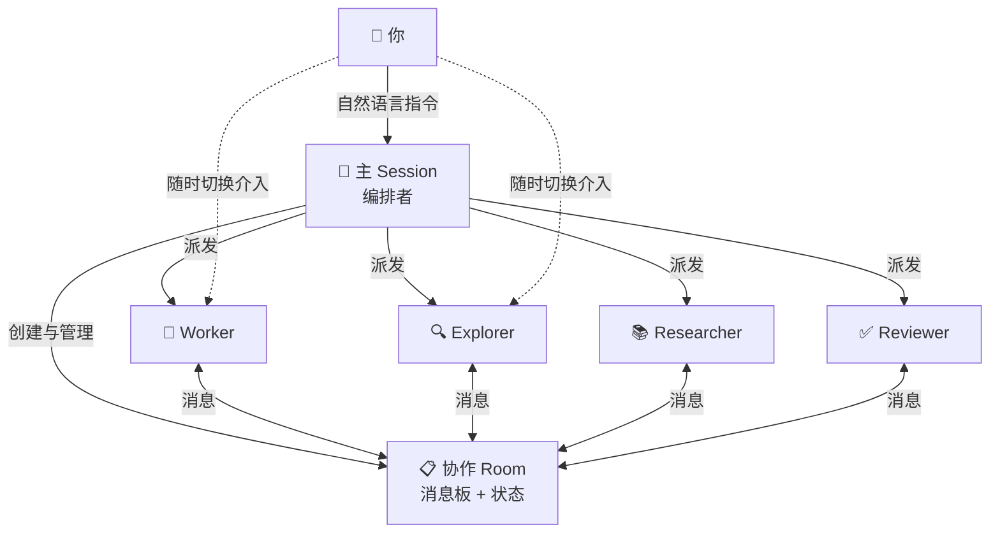

# pi-crew

**多智能体协作,尽在掌握。**

pi-crew 是专为 [Paseo](https://github.com/getpaseo/paseo) + [pi](https://github.com/earendil-works/pi) 生态打造的多智能体协作扩展。它不是又一个"让 AI 自己开会"的框架--而是让你随时看见、随时接管、随时介入的协作中枢。

---

## 为什么选择 pi-crew?

### 你的每个子智能体,都在眼前工作

不同于其他多智能体方案将子任务藏在黑盒中,pi-crew 的每个子智能体都是一个**独立的 Paseo 会话**。你可以在 Paseo 前端中随时切换到任意子智能体的工作界面,查看它的思考过程、工具调用、读写操作--**就像亲自坐在它旁边**。

### 随时介入,人在回路

发现问题?直接接管。子智能体卡住了?切进去给一条指令。方向偏了?随时纠正。pi-crew 不假设 AI 能完美自治--它假设你才是最终决策者,AI 是你高效的多线程助手。

### 看得见的协作

所有协作消息(任务分配、完成通知、依赖触发)都记录在公共消息板上。不是日志文件,是**活的对话记录**--你可以回溯任意时刻的任意交互,理解每个智能体为什么做了它所做的。



> 🧹 **会话即生命周期**:主 Session 关闭时,所有子智能体和对应的 Git worktree 自动清理,不留残留。
>
> 💻 **独立模式**:pi-crew 也可以脱离 Paseo 单独使用(仅 pi)。此时失去对子智能体的直接查看与交互能力,但所有编排功能完全一致。

---

## 与其他多智能体方案的对比

| | pi-crew | Claude Code Teams | AutoGen | CrewAI |
|---|---|---|---|---|
| **子智能体可见性** | ✅ Paseo 前端实时可见 | ❌ 终端轮切 | ❌ 代码级跟踪 | ❌ 日志可见 |
| **人在回路** | ✅ 随时介入任意子智能体 | ⚠️ 仅 lead 可交互 | ❌ 需编程介入 | ❌ 需编程介入 |
| **Git 隔离** | ✅ 每个 worker 独立 worktree | ❌ 共享文件冲突风险 | N/A | N/A |
| **任务依赖** | ✅ `{input:#N}` 声明式 | ⚠️ 共享任务列表 | 可配置 | 顺序/层级 |
| **崩溃恢复** | ✅ 心跳+看门狗自动恢复 | ❌ 无会话恢复 | ⚠️ Checkpoint | 有限 |
| **自定义智能体** | ✅ 一行 YAML 定义 | ⚠️ 子智能体定义 | 需编码 | 需编码 |
| **适合场景** | 编码、审查、研究 | 探索性任务 | 研究实验 | 角色扮演流程 |

**pi-crew 不是又一个"多智能体框架"**--它是一个让你在 Paseo 中像管理团队一样管理 AI 助手的操作面板。

**[演示: 人在回路实时介入](https://github.com/user-attachments/assets/9402942a-4b91-4936-82ef-e122d18623be)**
看看如何随时切换到任意子智能体的工作界面并实时接管。

**[演示: 审查-修复完整闭环](https://github.com/user-attachments/assets/1c6a8520-812c-4f67-ad9f-8d6e3c1be9f6)**
完整闭环演示: 审查者发现问题 → 修复者处理 → 再审直到通过。

---

## 快速开始

### 安装

```bash
pi install git:https://github.com/thaning0/pi-crew.git
```

安装即用。无需数据库、无需额外服务、无需配置文件。支持 Linux 和 macOS。

### 第一个多人协作

直接对 pi 说出你的需求,剩下的交给编排器:

> *"调研一下这个项目里 JWT + OAuth 应该怎么实现,出个方案,然后写出来。"*

pi-crew 会自动派出研究员收集上下文、规划师设计方案、worker 写代码--每个都是一个独立的 Paseo 会话,你可以随时切进去看、随时介入纠正。

### 全自动代码审查

> *"审查 src/auth 的安全问题和代码质量,修复发现的问题,然后再审一轮。"*

pi-crew 会自动执行编码-审查-修订-再审查的完整循环,最多 3 轮,直到审查通过。

### 并行功能开发

> *"登录页 UI、登录 API 接口、集成测试这三个东西并行开发。"*

三个 worker 同时开工,各自独立的 Git worktree,互不冲突。全部完成后一次性汇总。

### 依赖链自动接力

> *"先调研认证方案的整体格局,基于调研结果设计架构,然后实现。"*

pi-crew 自动串联任务--下游任务等待上游完成,自动触发,无需人工接手。

---

## 内置智能体

| 智能体 | 擅长 | Worktree 隔离 |
|--------|------|:---:|
| `worker` | 通用编码,含独立 Git 分支 | ✅ |
| `researcher` | 多源调研(代码+网络) | |
| `planner` | 制定结构化实施方案 | |
| `advisor` | 技术深度分析和调试指导 | |
| `code-quality-reviewer` | 代码质量审查 | |
| `plan-consistency-reviewer` | 方案一致性验证 | |
| `plan-evaluator` | 方案可行性评估 | |

> 💡 **`explore` 工具**: 编排者和子智能体均可使用 `explore` 工具进行快速代码、文件与网络探索——内部由临时 explorer 智能体驱动，无需手动创建。

### 自定义智能体

创建一个 `.md` 文件,一行配置,即刻拥有专属智能体:

```markdown
---
name: db-expert
description: 数据库设计与 SQL 优化专家
tools: read, grep, find, ls, todo, wait, bash, web_search
thinking: high
worktree: false
---

你是数据库专家。你的职责是设计表结构、优化查询、审查数据库变更。
在 Paseo 中独立运行,经消息板与团队协作。
```

放在 `.pi/crew_agents/`(项目级)或 `~/.pi/crew_agents/`(全局),自动生效。

> 🎯 **设计理念**：项目级 > 全局级 > 内置。你可以覆盖内置智能体的行为，而不需要修改扩展本身。

---

## 附带插件

pi-crew 附带两个轻量插件，帮助子智能体更高效地协调工作：

### `todo` — 任务进度追踪

子智能体用 `todo { action: "add", text: "..." }` 将工作拆分为检查点，用 `todo { action: "toggle", id: N }` 标记完成。进度更新显示在消息板上，供编排者和其他智能体了解每个任务的进展。

### `wait` — 异步等待

子智能体调用 `wait { reason: "..." }` 暂停并监听新消息（例如等待依赖任务完成、等待后台命令输出）。这避免了空转轮询，在空闲期间保持低 token 消耗。

两个插件安装后自动注册，无需额外配置。

---

## 事件驱动

crew 的工具不仅可由 LLM 调用，还支持通过 Pi 的 `pi.events` 事件总线**程序化触发**。其他 Pi 扩展可通过事件来创建子智能体或发送消息，无需经过 LLM。

```typescript
// 统一订阅公开生命周期反馈。
pi.events.on("crew:event", (payload) => {
    console.log(payload.event, payload.event_id, payload.spawn_task_id);
});

// 立即激活 + request_id 回放。
pi.events.emit("crew:add", {
    name: "worker-01",
    type: "worker",
    task: "实现登录模块",
    request_id: "login-worker-01",
});

// 手动激活 + 持有租约。
pi.events.emit("crew:add", {
    name: "review-gate",
    type: "worker",
    activation: "manual",
    hold_timeout_ms: 30_000,
    request_id: "review-gate-01",
    metadata: { ticket: "AUTH-42" },
});

// 在创建的子进程中，其他插件可直接从 process.env 读取同样的
// opaque bootstrap 负载。
const rawExtensionPayload = process.env.PI_ROOM_EXTENSION_PAYLOAD;
const extensionPayload = rawExtensionPayload
    ? JSON.parse(rawExtensionPayload)
    : null;

// 后续消息仍然通过 member_target + crew:tell 路由。
pi.events.emit("crew:tell", {
    to: "worker-01",
    summary: "方案更新",
    content: "改用 JWT 方案",
    kind: "info",
});

// 代际控制使用 spawn_task_id，可选 command_id 做回放。
pi.events.emit("crew:release", {
    spawn_task_id: "spawn-123",
    command_id: "release-123",
});
```

| 事件 | 参数 | 说明 |
|------|------|------|
| `crew:add` | `name`, `type`, `task?`, `model?`, `transient?`, `request_id?`, `activation?`, `hold_timeout_ms?`, `metadata?` | 创建子智能体，并可附带回放与受控激活参数 |
| `crew:tell` | `summary` (必填), `to?`, `content?`, `kind?`, `broadcast?` | 发送消息（kind 默认 `"info"`） |
| `crew:release` | `spawn_task_id`, `command_id?`, `request_id?` | 打开 held 代际的正常投递 |
| `crew:abort` | `spawn_task_id`, `command_id?`, `request_id?`, `reason?` | 在正常工作开始前丢弃 held 代际 |
| `crew:event` | 包含 `event_id`, `event`, `member_target`, `spawn_task_id`, `request_id?`, `command_id?` 等字段的生命周期负载 | 面向集成方的公开生命周期反馈流 |

错误静默处理：非法参数或无 owner room 时记录日志，不抛异常、不阻塞事件总线。

- 对外集成应订阅 `crew:event`，而不是直接读取 room 文件或 spawn-job 状态。
- 公开的 `crew:event` 生命周期通知从 **owner session** 发布；请在 owner session 中订阅。
- `member_target` 用于后续 `crew:tell` 路由；`spawn_task_id` 用于 `crew:release` / `crew:abort` 和代际恢复。
- 重用同一个 `request_id` 会回放最新的 `crew:add` 结果，包括已知终态。
- 对同一代际重用同一个 `command_id`，会回放此前的 `crew:release` 或 `crew:abort` 结果。
- `metadata` 必须是 JSON 可序列化对象。crew 会在 `crew:event` 中回显并通过 `PI_ROOM_EXTENSION_PAYLOAD` 传递给子进程。
- `PI_ROOM_EXTENSION_PAYLOAD` 是面向其他插件的 **opaque 透传通道**。crew 不会解析或解释其业务含义。
- 事件投递是 best-effort 的；订阅方应使用 `event_id` 去重。

---

## 协作模式

### 模式 1:串行流水线

```bash
crew_add → crew_tell(task) → 等待完成 → crew_tell(task) → ...
```

适合步骤明确、依赖线性的工作流。

### 模式 2:并行工作

```bash
crew_batch {
  template: "parallel-work-aggregate",
  params: {
    workers: [
      { name: "fe", type: "worker", task: "实现前端登录页面" },
      { name: "be", type: "worker", task: "实现 /api/login 接口" },
      { name: "test", type: "worker", task: "编写登录模块的集成测试" }
    ]
  }
}
```

三个 worker 同时开工,各自独立的 Git worktree,互不干扰。完成后一次性汇总。

### 模式 3:审查循环

```bash
crew_batch {
  template: "implement-review-loop",
  params: { author: ..., reviewers: [...], initialAuthorTask: ..., maxRounds: 3 }
}
```

写代码 → 审查 → 反馈 → 修订 → 再审查,直到通过或达到最大轮数。

### 模式 4:审查修复循环

```bash
crew_batch {
  template: "review-fix-loop",
  params: { reviewer: ..., fixer: ..., initialReviewTask: ..., maxRounds: 3 }
}
```

审查者先检查已有产物（设计文档、代码 diff、实现结果等）→ 修复者处理问题 → 再审,直到通过或达到最大轮数。

### 模式 5:自动接力链

```bash
crew_tell { to: "researcher", kind: "task", content: "调研认证模块。完成后 @planner 汇报" }
crew_tell { to: "planner", kind: "task", content: "依赖 researcher 的结果 {input:#55}。制定方案后 @worker" }
crew_tell { to: "worker", kind: "task", content: "依赖 planner 的方案 {input:#56}。完成后回复" }
```

一次性布置所有任务,系统自动在依赖满足时触发下一个智能体。你只需在 Paseo 中观察进展,随时介入。

---

## Git Worktree 隔离

Worker 智能体在自己的 Git worktree 中工作,与其他智能体完全隔离:

```
主工作区 (你的 repo)
├── /tmp/pi-agent-worker-a1b2c3/   ← Worker A 的独立分支
├── /tmp/pi-agent-worker-d4e5f6/   ← Worker B 的独立分支
└── /tmp/pi-agent-worker-g7h8i9/   ← Worker C 的独立分支
```

每个 worker 完成任务时自动 `git add -A && git commit`,生成快照。你可以用 `crew_merge` 将任意 worker 的成果合并回主分支:

```bash
crew_merge { name: "worker", strategy: "merge" }
crew_merge { name: "worker", strategy: "rebase" }
crew_merge { name: "worker", strategy: "ff-only" }
```

---

## 命令参考

### 管控命令(仅 lead)

| 命令 | 说明 |
|------|------|
| `crew_add {name, type, model?, task?, transient?}` | 创建子智能体 |
| `crew_remove {name}` | 永久移除子智能体 |
| `crew_merge {name, strategy?, deleteBranchAfterMerge?}` | 合并 worktree 快照 |
| `crew_batch {template, params}` | 执行批量协作模板 |

### 通信命令(所有成员)

| 命令 | 说明 |
|------|------|
| `crew_tell {to?, summary, content?, kind?}` | 发送消息(任务/问题/信息) |
| `crew_reply {seq, summary, content?, kind}` | 回复任务(完成/错误) |
| `crew_read {seq, offset?, limit?}` | 读取消息详情 |

### 查看命令

| 命令 | 说明 |
|------|------|
| `crew_who {}` | 查看所有成员状态 |
| `crew_tasks {}` | 查看所有任务状态 |
| `crew_messages {limit?, filter?}` | 查看消息板 |

---

## 在 Paseo 中的体验

当你通过 Paseo 使用 pi-crew 时:

1. **每个子智能体都是一个独立会话**--在 Paseo 侧边栏中可见,点击即切换
2. **实时思考过程**--看到子智能体的每一步推理和工具调用
3. **随时介入**--子智能体卡住了?切进去给指令。方向偏了?纠正它。写错了?叫停重来
4. **消息板一目了然**--所有任务状态、依赖触发、完成通知都在消息板中
5. **快照合并**--审查完 worker 的代码后,一键合并到主分支

这不是"AI 替你工作"--这是"你指挥一个 AI 团队工作"。

---

## 环境变量

| 变量 | 用途 | 默认值 |
|------|------|--------|
| `PI_ROOM_POLL_INTERVAL_MS` | 消息轮询间隔 | 2000 |
| `PI_ROOM_DELIVERY_DEBOUNCE_MS` | 消息投递去抖 | 1000 |
| `PI_ROOM_LOG_LEVEL` | 日志级别 | `error` |

完整配置列表见文档(很少需要手动调整--默认值覆盖绝大多数场景)。

---

## Paseo 兼容

- 本插件 2.0.0 要求 Paseo >= 0.1.79 
- 旧版本（1.x）兼容 Paseo <= 0.1.78

---

## 许可

MIT
