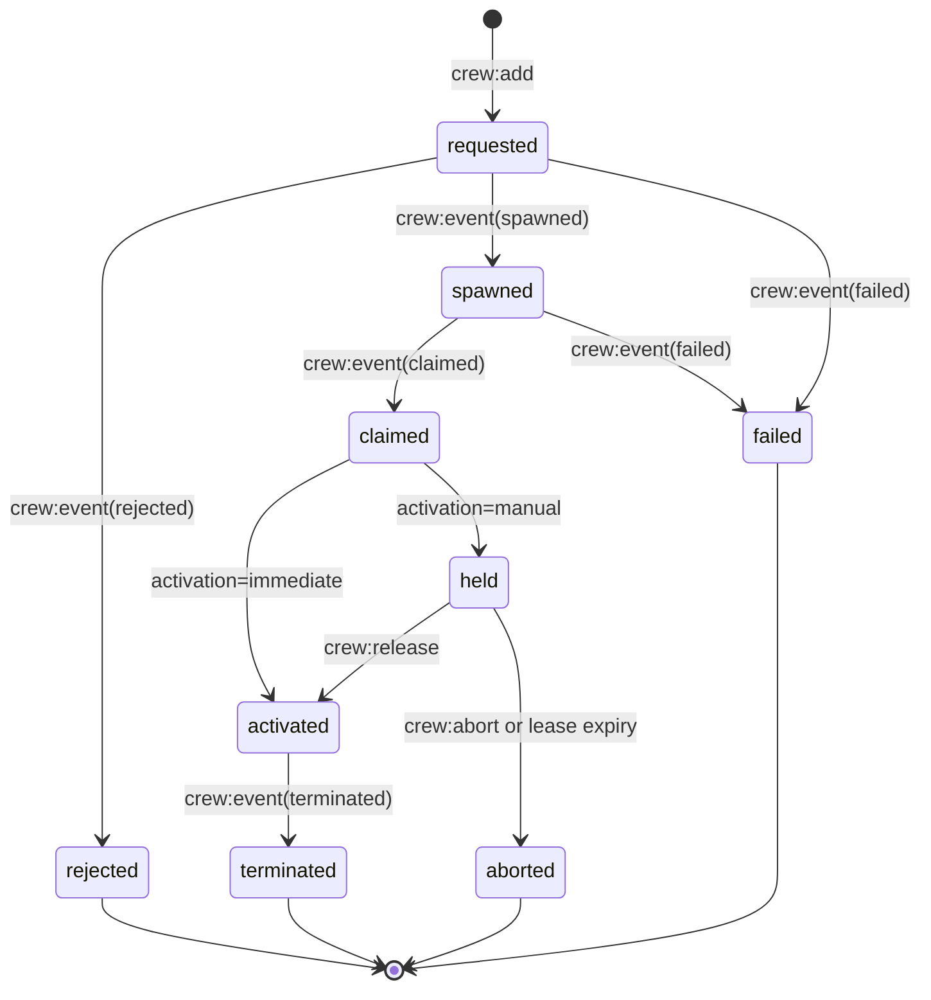

# Crew External Integration Protocol

> **Status:** Implemented | **Plan:** [docs/plans/2026-05-26-crew-event-feedback-protocol-implementation.md](./plans/2026-05-26-crew-event-feedback-protocol-implementation.md)
> **Audience:** pi-crew maintainers and extension authors integrating through `pi.events`
> **Related:** [docs/plans/2026-05-26-crew-event-feedback-protocol-implementation.md](./plans/2026-05-26-crew-event-feedback-protocol-implementation.md)

## Summary

`pi-crew` already exposes command-side integration through `crew:add` and `crew:tell`, but that surface is still write-only from the caller's perspective.

External extensions can ask crew to spawn a member or send a message, yet they cannot observe a stable lifecycle protocol without reading room files, spawn jobs, or other internal state.

This document proposes a generic external integration protocol with three properties:

1. keep `pi-crew` a general-purpose subagent coordination plugin rather than a business-specific orchestration layer
2. expose a clean event-driven feedback contract so other extensions can correlate requests with member lifecycle transitions
3. support safe retry and recovery for external callers without exposing room internals

The protocol is intentionally layered:

- the default path remains simple: `crew:add` starts a member immediately
- a caller may optionally request controlled activation for the smaller set of integrations that need a pre-start handshake
- a caller may retry the same logical request safely by reusing its own `request_id`

The protocol does not introduce business concepts such as research tasks, controller recommendations, or domain-specific lifecycle meanings.

## Problem

Today the event bus surface is asymmetric.

- inbound command channels exist: `crew:add`, `crew:tell`
- outbound lifecycle channels do not exist as a stable public contract
- request submission is fire-and-forget from the caller's point of view

Internally, `pi-crew` already tracks useful lifecycle facts:

- spawn requested
- runtime created
- member bootstrap claimed
- message delivery enabled for a concrete generation
- spawn failed or was cancelled
- member later terminates or is removed

Those transitions are useful far beyond one business integration. Any extension that delegates work through crew can benefit from a stable answer to questions like:

- did my spawn request succeed or fail?
- which member/runtime/session corresponds to my request?
- is the member merely created, or actually claimed by a live subagent session?
- if I asked for controlled activation, when is it safe to release or abort?
- if my extension times out or restarts, how do I recover the same request instead of creating a duplicate member?

Without a public protocol, integrators are pushed toward one of two bad outcomes:

- inspect internal room files and spawn-job state directly
- invent plugin-specific ad hoc wrappers around `crew:add`

Both create coupling that makes `pi-crew` less reusable.

## Goals

- Keep the public protocol generic and free of business semantics.
- Preserve the default user experience: add a subagent and it starts working.
- Give external extensions a stable correlation mechanism for asynchronous member lifecycle.
- Expose enough lifecycle feedback that callers do not need to inspect room internals.
- Support safe retry and crash recovery for the same logical external request.
- Support a clean optional path for integrations that require a pre-start handshake.
- Keep room state, spawn jobs, and watchdog details as implementation internals.

## Non-Goals

- Do not turn `pi-crew` into a canonical workflow-state system.
- Do not promise exactly-once delivery or durable queue semantics on the event bus.
- Do not expose room storage layout as part of the public contract.
- Do not require all members to use a paused or manually released startup path.
- Do not support indefinitely held members with no expiry or cleanup policy.
- Do not replace room messages, batch workflows, or existing human-in-the-loop controls.

## Design Overview

The protocol has two layers.

### Layer 1: Core feedback protocol

This layer is always available and should cover the common case.

- `crew:add` remains the command for creating a member
- callers may attach a correlation token and opaque metadata
- repeated `crew:add` requests with the same `request_id` are idempotent within a replay window
- `pi-crew` emits lifecycle feedback on a single outbound channel: `crew:event`

This keeps the normal product behavior unchanged for most users while making the integration surface observable.

### Layer 2: Optional controlled activation

Some integrations need a stronger guarantee than "the member exists."

They need "the member has been created, but must not start normal work until I explicitly release it."

That requirement should be handled as an optional capability rather than the default behavior for all callers.

The protocol therefore allows `crew:add` to request manual activation. When this capability is used:

- the member may spawn and claim as usual
- `pi-crew` suppresses normal task delivery until released
- the held generation carries an expiry lease rather than an indefinite pause
- the caller may later send `crew:release` or `crew:abort`

This keeps the core protocol simple while still supporting stricter integrations.

## Public Command Surface

### `crew:add`

Current fields remain valid.

Proposed optional additions:

```ts
type CrewAddEventData = {
  name: string;
  type: string;
  model?: string;
  task?: string;
  transient?: boolean;

  request_id?: string;
  activation?: "immediate" | "manual";
  hold_timeout_ms?: number;
  metadata?: Record<string, unknown>;
};
```

Field semantics:

- `request_id`: caller-owned correlation token echoed back on feedback events. It is also the caller's idempotency key within the active owner room. Re-sending the same logical request with the same `request_id` must not create a second generation.
- `activation`: defaults to `"immediate"`. `"manual"` requests controlled activation.
- `hold_timeout_ms`: optional hold lease for `activation: "manual"`. If omitted, crew uses a server-defined default. It is ignored for `activation: "immediate"`.
- `metadata`: opaque caller payload echoed back in lifecycle events. `pi-crew` stores and forwards it but does not interpret its business meaning. It must be a JSON-serializable object, and the same payload is forwarded to the spawned child process as `PI_ROOM_EXTENSION_PAYLOAD` for other plugins to read directly from `process.env`.

For idempotency, the material request fields are the normalized values of `name`, `type`, `model`, `task`, `transient`, `activation`, and `hold_timeout_ms` after trimming strings and applying protocol defaults. `hold_timeout_ms` is material only when the effective activation mode is `manual`; immediate requests normalize it away. `metadata` is not material for generation identity; the first accepted metadata payload wins for later replay and lifecycle echo.

If the caller reuses the same `request_id` with different material request fields, crew should reject the request rather than silently creating or mutating a generation.

### `crew:tell`

No semantic change is required for this proposal.

Follow-up message routing continues to use the canonical member target carried as `member_target` in lifecycle events. Generation-scoped activation control uses `spawn_task_id`, not `crew:tell`.

### `crew:release`

Optional command used only when a member was created with `activation: "manual"`.

```ts
type CrewReleaseEventData = {
  spawn_task_id: string;
  command_id?: string;
  request_id?: string;
};
```

`spawn_task_id` is the required control handle because it targets one concrete member generation.

`command_id` is an optional caller-owned idempotency key for this release attempt. Re-sending the same release with the same `command_id` must replay the resulting activation outcome rather than opening a second transition.

The command releases normal task delivery for that held generation. If the generation is unknown, already terminal in the opposite direction, or not in a releasable state, crew should emit `crew:event(failed)` with `phase: "activation"` and echo the supplied identifiers when available.

### `crew:abort`

Optional command used only when a member was created with `activation: "manual"`.

```ts
type CrewAbortEventData = {
  spawn_task_id: string;
  command_id?: string;
  request_id?: string;
  reason?: string;
};
```

`command_id` is an optional caller-owned idempotency key for this abort attempt. Re-sending the same abort with the same `command_id` must replay the resulting abort outcome rather than re-running cleanup.

This lets the caller discard a held member cleanly when pre-start checks fail. If the generation is unknown, already terminal in the opposite direction, or not abortable, crew should emit `crew:event(failed)` with `phase: "activation"` and echo the supplied identifiers when available.

## Public Feedback Surface

All lifecycle feedback is emitted on one channel.

### `crew:event`

```ts
type CrewLifecycleEvent = {
  protocol_version: 1;
  event_id: string;
  event:
    | "rejected"
    | "spawned"
    | "claimed"
    | "activated"
    | "failed"
    | "aborted"
    | "terminated";
  occurred_at: string;

  request_id?: string;
  command_id?: string;
  requested_name?: string;
  member_target?: string;
  member_type?: string;
  room_id?: string;
  spawn_task_id?: string;
  runtime_id?: string | null;
  session_id?: string | null;
  activation?: "immediate" | "manual";
  metadata?: Record<string, unknown>;

  phase?: "request" | "spawn" | "claim" | "activation" | "runtime";
  delivery_state?: "pending" | "held" | "enabled" | "ended";
  hold_expires_at?: string | null;
  reason?: string;
  error?: string;
};
```

### Event semantics

`rejected`

- emitted when `crew:add` is rejected before a member generation exists
- examples: invalid payload, no active owner room, unknown agent type, `request_id` reuse with conflicting payload
- may omit `member_target`, `spawn_task_id`, `runtime_id`, and `session_id`
- should still echo `request_id` and `requested_name` when available

`spawned`

- emitted after `pi-crew` has accepted the add request and created a concrete member generation
- may include `runtime_id`
- does not imply the member has claimed a live subagent session yet
- should include `member_target` once crew has chosen the concrete message-routing target for that member record
- should include `delivery_state: "pending"` for immediate activation and `delivery_state: "held"` for manual activation once the hold state is persisted
- manual generations should include `hold_expires_at` when known

`claimed`

- emitted on the first persisted transition where the generation gains a non-null `session_id`
- indicates that crew now knows which session belongs to the member generation
- must be emitted at most once per generation
- does not by itself imply that normal task delivery is enabled
- held claimed generations should continue to echo `delivery_state: "held"` and `hold_expires_at`

`activated`

- emitted when crew opens normal task delivery for the generation
- for default activation, this may happen shortly after `claimed`
- for manual activation, this happens only after `crew:release`
- this event is about the crew-level delivery gate, not process creation and not proof that a user task has already started running

`failed`

- emitted when a request cannot progress to a usable lifecycle state
- `phase` explains where the failure occurred: request, spawn, claim, or activation
- unlike `rejected`, `failed` implies a member generation or control action was already in progress
- invalid or conflicting `crew:release` and `crew:abort` commands should surface here with `phase: "activation"`

`aborted`

- emitted when a held generation is discarded before normal work starts
- this includes explicit caller aborts and lease-expiry cleanup
- `reason` should distinguish cases such as `caller_abort` and `hold_expired`

`terminated`

- emitted when a claimed or activated member generation reaches an irreversible runtime end
- this is a runtime lifecycle fact, not a business workflow conclusion
- v1 should use it only for irreversible generation-end outcomes
- claimed-but-never-activated held members that are explicitly aborted or expire should emit `aborted`, not `terminated`
- reusable stop flows that leave the member generation intact should not emit `terminated`

## Identity Rules

The protocol deliberately separates caller correlation from crew ownership.

- `request_id` belongs to the caller and is the public retry key for the same logical request
- `requested_name` is the caller-provided alias from `crew:add.name`
- `member_target` is the canonical opaque routing token emitted by crew for follow-up directed messaging
- `spawn_task_id` identifies one concrete member generation and is the safest control handle for `crew:release` and `crew:abort`
- `member_target` may differ from `requested_name` and is not a generation-stable control handle; callers should use it for follow-up messaging while the member record exists, and use `spawn_task_id` for generation recovery and control
- `runtime_id` and `session_id` belong to `pi-crew` runtime/session layers
- `command_id` belongs to the caller and identifies one release or abort control attempt when present
- `metadata` remains caller-owned opaque data
- v1 does not expose a separate durable `member_id`; `spawn_task_id` is the only generation-stable public handle

This avoids turning one integration's identifiers into shared crew semantics.

## Practical Integration Guidance

Use the event bus as the public integration boundary.

```ts
pi.events.on("crew:event", (payload) => {
  console.log(payload.event, payload.event_id, payload.spawn_task_id);
});

pi.events.emit("crew:add", {
  name: "worker-01",
  type: "worker",
  request_id: "worker-01",
});

pi.events.emit("crew:add", {
  name: "review-gate",
  type: "worker",
  activation: "manual",
  hold_timeout_ms: 30_000,
  request_id: "review-gate-01",
});

pi.events.emit("crew:release", {
  spawn_task_id: "spawn-123",
  command_id: "release-123",
});
```

- subscribe to `crew:event` instead of reading room files or spawn-job state directly
- use `member_target` for follow-up `crew:tell` routing
- use `spawn_task_id` for generation-scoped `crew:release` / `crew:abort`
- reuse `request_id` to replay the latest `crew:add` outcome
- reuse `command_id` to replay the prior control outcome for the same generation
- treat delivery as best-effort and deduplicate with `event_id`

## Lifecycle Model



Duplicate `crew:add` submissions with the same `request_id` do not create parallel generations. They replay the latest known lifecycle state for the same logical request.

## Retry, Deduplication, And Recovery

The outbound protocol is best-effort. Callers must tolerate duplicate, delayed, or replayed lifecycle events.

- `event_id` uniquely identifies one emitted lifecycle envelope and is the primary deduplication key for subscribers.
- `request_id` is scoped to the active owner room and is the caller-facing recovery key.
- Re-sending `crew:add` with the same `request_id` and the same material payload must not create a second generation.
- Re-sending `crew:add` with the same `request_id` should cause crew to re-emit the latest known lifecycle event, including any known `spawn_task_id`, `member_target`, and terminal outcome.
- Reusing a `request_id` with conflicting material payload should emit `rejected` with a conflict reason.
- `command_id` is scoped to a control verb plus `spawn_task_id`. Re-sending the same `crew:release` or `crew:abort` with the same `command_id` must replay the already-computed outcome for that control attempt.
- Repeated `crew:release` for a generation that is already activated may be treated as a success-equivalent replay and re-emit `activated`. Repeated `crew:abort` for a generation that is already aborted may re-emit `aborted`.
- Conflicting reuse of the same `command_id` for a different control verb or different `spawn_task_id` should emit `failed` with an activation-phase conflict reason.
- Crew must retain enough request and control correlation state to recover terminal events and replay handles after owner restart or delayed reconciliation. At minimum this includes `request_id`, replayable `command_id` records for control actions, activation mode, `spawn_task_id`, and any replayed `metadata`.

This keeps the protocol event-driven without requiring integrators to read room files for recovery.

## Delivery Gate Semantics

The protocol intentionally separates lifecycle activation from room-task execution.

- `activated` means the crew delivery gate is open for normal task traffic.
- `activated` does not guarantee that a user task has already been assigned.
- `activated` does not guarantee that dependency-gated work has started executing.
- while `delivery_state: "held"`, caller-directed `task`, `info`, and `question` traffic must stay blocked rather than partially waking the member through `crew:tell`.
- manual members may still receive bootstrap-safe protocol traffic needed to join, heartbeat, cancellation reconciliation, lease expiry cleanup, and release or abort coordination while their normal caller-directed delivery remains held.
- any replayed lifecycle event whose current delivery state is `held` should continue to include `hold_expires_at`.
- room messages remain the surface for task-level progress, completion, errors, and dependency coordination.

This keeps lifecycle feedback generic while preserving richer task semantics on the room message board.

## Why A Single Feedback Channel

The outbound protocol uses one channel, `crew:event`, instead of many specialized channels.

Reasons:

- external integrations subscribe once and switch on `event`
- future lifecycle expansion does not multiply event-bus listeners
- versioning and payload evolution stay centralized
- the channel reflects a coherent lifecycle stream instead of a set of unrelated notifications

## Why Optional Manual Activation

Making controlled activation optional is the main product-boundary decision in this design.

If manual activation were required for every member, `pi-crew` would become harder to use for ordinary interactive delegation.

If manual activation were unavailable, stricter integrations would have to race against member startup or fall back to private hacks.

The compromise is intentionally simple:

- default behavior stays immediate
- strict integrations opt into manual activation only when needed
- held generations expire instead of becoming hidden long-lived state

That keeps `pi-crew` generic while still supporting higher-assurance clients.

## Compatibility

- Existing `crew:add` emitters continue to work with no changes.
- Existing `crew:tell` emitters continue to work with no changes.
- Extensions that do not subscribe to `crew:event` are unaffected.
- `request_id`, `activation`, `hold_timeout_ms`, and `metadata` are optional additions to `crew:add`.
- `command_id` is an optional addition to `crew:release` and `crew:abort`.
- Callers that omit `request_id` keep the current best-effort semantics and do not receive idempotent replay behavior.
- Callers that omit `command_id` on control commands keep best-effort semantics for those commands.
- Manual activation is opt-in only.
- `metadata` is opaque, size-limited, and retained only for lifecycle correlation and replay.

## Rollout Guidance

Roll out in two increments.

### Increment 1: Core feedback and safe retry

- add `request_id`, `activation`, `hold_timeout_ms`, and `metadata` to `crew:add`
- treat `request_id` as a caller-scoped idempotency key and replay handle
- emit `rejected`, `spawned`, `claimed`, and `failed`
- include `event_id`, `member_target`, and `delivery_state` in `crew:event`
- document that `activation: "manual"` may remain reserved until controlled activation is enabled

### Increment 2: Controlled activation

- add `crew:release` and `crew:abort`, including optional `command_id`
- persist hold-lease state including `hold_expires_at`
- gate normal task delivery for held members
- emit `activated`, `aborted`, and `terminated`
- auto-abort expired held generations with a machine-readable reason

This sequencing keeps the protocol useful early without forcing the stricter activation path into the first patch.

## Open Questions

- What minimum replay-retention window should crew guarantee for `request_id` recovery after terminal completion?
- What maximum size should be allowed for `metadata`, and should oversize payloads be rejected or truncated?
- Should the default hold lease be globally fixed, or adapter-specific with a documented minimum bound?