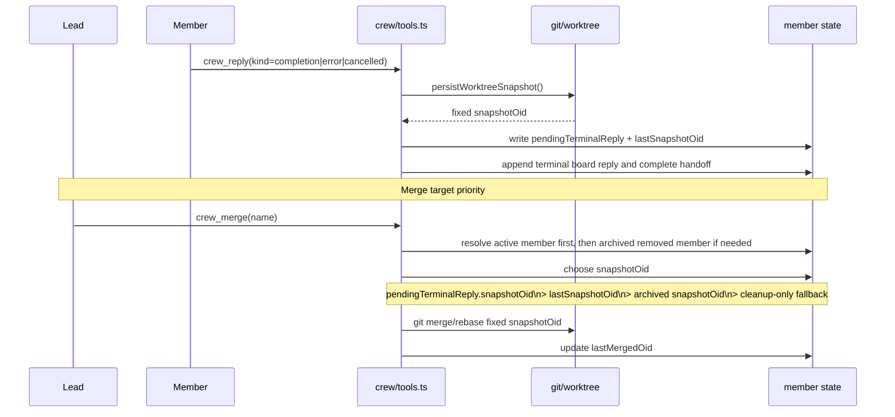

# Crew Lead Merge Snapshot Implementation

**Status:** Implemented on 2026-05-06.

**Related plan:** [plans/2026-05-06-crew-lead-merge-snapshot-plan.md](./plans/2026-05-06-crew-lead-merge-snapshot-plan.md)

## Summary

This batch closes the remaining snapshot-merge gaps for `extensions/crew`:

1. `crew_merge` can now resolve archived removed members without weakening normal active-member targeting.
2. stop/remove/watchdog cleanup now share the same archive semantics: clear the active worktree, write `worktreeResult` as best-effort fallback, and preserve terminal snapshot precedence.
3. PI dead-runtime watchdog paths now archive and clean worktrees even when `runtimeId` is already `null`.
4. Tests and docs now match the snapshot-OID-first merge model.

## Key Files Changed

- `extensions/crew/storage.ts`
  - added `resolveMemberTargetForMerge()` so `crew_merge` can reach removed archived members when appropriate
- `extensions/crew/tools.ts`
  - `executeCrewMerge()` now uses merge-specific target resolution
  - `executeCrewStop()` now archives cleanup fallback work when the stop path ends the runtime
  - `executeCrewRemove()` now uses the shared cleanup/archive helper
- `extensions/crew/watchdog.ts`
  - watchdog cleanup now archives worktrees even when the member runtime is already gone
- `extensions/crew/worktree-cleanup.ts`
  - new shared helper for cleanup fallback archival and `worktreeResult` writeback
- `extensions/crew/room-feasibility.test.ts`
  - added remove/watchdog/stop snapshot-priority and archived-merge coverage
- `extensions/crew/watchdog.test.ts`
  - added PI dead-runtime watchdog cleanup coverage

## Snapshot-First Reply / Merge Flow

## Behavior Notes

- Cleanup fallback snapshots live in `worktreeResult.snapshotOid`; they do not replace `pendingTerminalReply.snapshotOid` or `lastSnapshotOid`.
- `crew_merge` still prefers active members for normal alias resolution. Removed archived members are only used when no active target matches, or when the caller uses the removed member's exact internal id / `alias#suffix` label.
- `crew_stop`, `crew_remove`, and watchdog cleanup all clear `member.worktree` after successful archive cleanup.

## Verification

Validated with:

- `cd /home/thn/.pi/agent/extensions/crew && npx vitest run room-feasibility.test.ts -t "keeps the terminal snapshot mergeable after crew_remove cleanup archives fallback work"`
- `cd /home/thn/.pi/agent/extensions/crew && npx vitest run room-feasibility.test.ts -t "archives stop cleanup fallback without replacing the terminal snapshot merge target"`
- `cd /home/thn/.pi/agent/extensions/crew && npx vitest run room-feasibility.test.ts -t "keeps the terminal snapshot as the default merge target after watchdog cleanup archives fallback work"`
- `cd /home/thn/.pi/agent/extensions/crew && npx vitest run watchdog.test.ts -t "pi dead-runtime watchdog cleanup still archives fallback work and removes the worktree"`
- `cd /home/thn/.pi/agent/extensions/crew && npx vitest run room-feasibility.test.ts watchdog.test.ts`
- `cd /home/thn/.pi/agent/extensions/crew && npx vitest run`
- `cd /home/thn/.pi/agent/extensions/crew && npm run typecheck`
- `bash /home/thn/.copilot/skills/mermaid/render_mermaid.sh --format svg` with the Mermaid source above

Observed results:

- targeted regression tests passed
- broader focused suite passed: `98 passed`
- full crew suite passed: `13 files, 290 tests`
- typecheck passed
- Mermaid rendering succeeded

## Residual Caveats

- Cleanup fallback snapshots are still best-effort archival for exceptional teardown paths; they are not a substitute for terminal reply snapshots.
- `crew_merge` intentionally does not auto-resolve ambiguity across multiple removed generations sharing the same alias; callers should use the exact internal id or `alias#suffix` label in that case.
