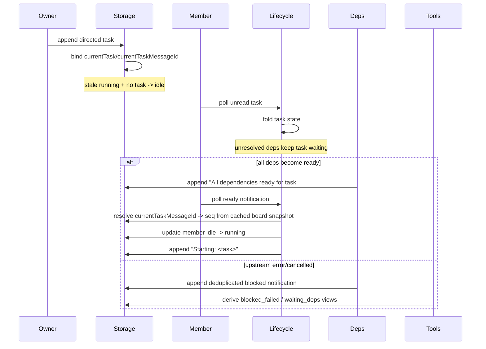

# Crew Member / Task State Optimization Implementation

**Status:** Implemented on 2026-05-06.

**Related plan:** [plans/2026-05-06-member-task-state-optimization-plan.md](./plans/2026-05-06-member-task-state-optimization-plan.md)

## Summary

This change set closes the review-and-iteration loop for the crew member/task state optimization work:

1. Dependency-gated tasks no longer collapse into a misleading raw/display `running` state before they are actually ready to execute.
2. Dependency-ready transitions now align board `seq` with `currentTaskMessageId` without repeatedly rescanning the full board during one unread batch.
3. Upstream terminal failures proactively surface `blocked_failed` once per downstream task, instead of leaving dependents stuck in an ambiguous non-terminal state.
4. Task reachability and stale-state normalization now preserve the lifecycle/task split: stop tombstones stay blocked with their dedicated error, stale `running + no task` members normalize back to `idle`, and `error` members must recover before accepting a new task.

## Implemented Changes

### 1. Dependency-gated task assignment no longer fakes `running`

- `extensions/crew/dispatch.ts` now distinguishes dependency-bearing tasks from ready tasks during local state folding.
- A member that receives a task with unresolved `{input:#N}` placeholders keeps its lifecycle state unless it was in a stale `running`-without-task combination, in which case it is normalized back to `idle`.
- `extensions/crew/storage.ts` mirrors that normalization on the owner append path so persisted state does not advertise a false execution start before the member polls.

### 2. Real start now happens on the member-side ready path

- `extensions/crew/lifecycle.ts` keeps the “ready at assignment” async check for dependency-bearing tasks.
- The dependency-ready control path now resolves `currentTaskMessageId -> seq` using a reused board snapshot, so a batch containing multiple readiness notifications does not repeatedly reload the full message board.
- `Starting: <task>` is still emitted only when the member actually crosses into `running`.

### 3. Task gating and reachability semantics are explicit

- `extensions/crew/storage.ts` gates new task assignment on unclosed-task ownership first.
- Stopped tombstones still fail with the dedicated “must be removed” path.
- Recoverable-but-not-yet-recovered `error` members are no longer considered task-reachable; they must return to `idle` before taking new work.

### 4. Failure propagation and task-state derivation were hardened

- `extensions/crew/task-terminal.ts` and `extensions/crew/deps.ts` now proactively send deduplicated blocked-failure notifications when an upstream task ends in `error` or `cancelled`.
- `extensions/crew/schemas.ts` and `extensions/crew/types.ts` expose the expanded task status vocabulary used by the optimized state model.

## Key Files Changed

- `extensions/crew/dispatch.ts`
  - dependency-aware task intake
  - stale `running` normalization for dependency-gated tasks
- `extensions/crew/lifecycle.ts`
  - cached board snapshot reuse for readiness notification seq lookup
  - member-side real-start transition remains the single `Starting:` source
- `extensions/crew/storage.ts`
  - task gating based on unclosed task + reachability
  - stop tombstone protection
  - owner-side stale `running` normalization
  - shared `resolveTaskSeqByMessageIdFromEntries()` helper
- `extensions/crew/task-terminal.ts`
  - proactive blocked-dependent notification wiring
- `extensions/crew/dispatch.test.ts`
  - dependency control delivery and task-intake edge cases
- `extensions/crew/state-derivation.test.ts`
  - waiting/blocked/ready transitions, non-idle ready guard, stale `running` normalization, single `Starting:` emission
- `extensions/crew/storage.test.ts`
  - preloaded board-entry seq lookup helper
  - error-member task reachability guard

## Dependency-Gated Task Flow

## Validation

The following validation commands were run successfully:

- `cd /home/thn/.pi/agent/extensions/crew && npx vitest run dispatch.test.ts state-derivation.test.ts room-feasibility.test.ts storage.test.ts lifecycle.test.ts`
- `cd /home/thn/.pi/agent/extensions/crew && npm run typecheck`
- `cd /home/thn/.pi/agent/extensions/crew && npx vitest run`
- `bash /home/thn/.copilot/skills/mermaid/render_mermaid.sh --format svg` with the Mermaid source above

Observed results:

- focused regression suite passed: `5 files, 154 tests`
- full crew suite passed: `14 files, 312 tests`
- typecheck passed
- Mermaid rendering succeeded

## Notes

- This implementation keeps the documented **Phase 1** scope: owner-authored directed tasks are the authoritative dependency-registration path.
- The plan document was updated to record two implementation clarifications discovered during review:
  - `error` members must recover to `idle` before receiving a new task
  - a stale `running` member with no unclosed task may be normalized back to `idle` during assignment to restore lifecycle invariants
- No unrelated repository changes were included; the resulting commit should remain scoped to `extensions/crew`.
