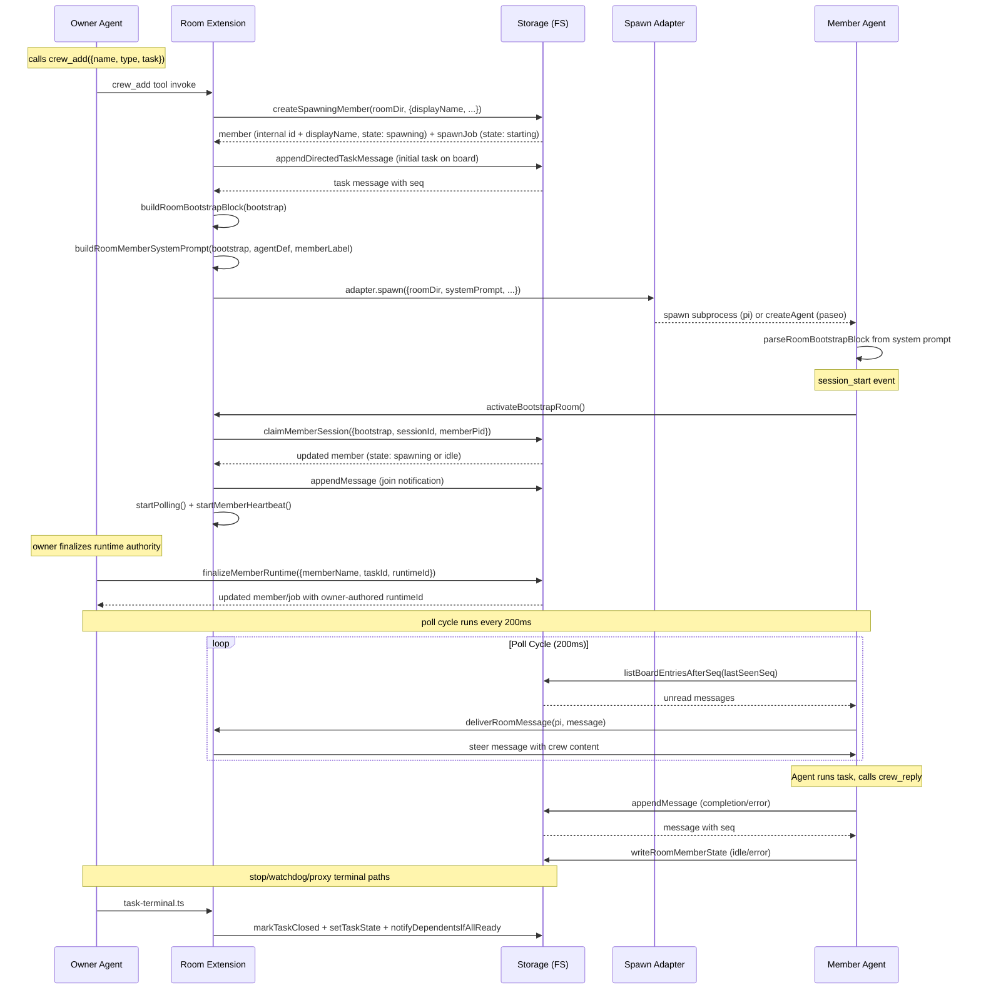
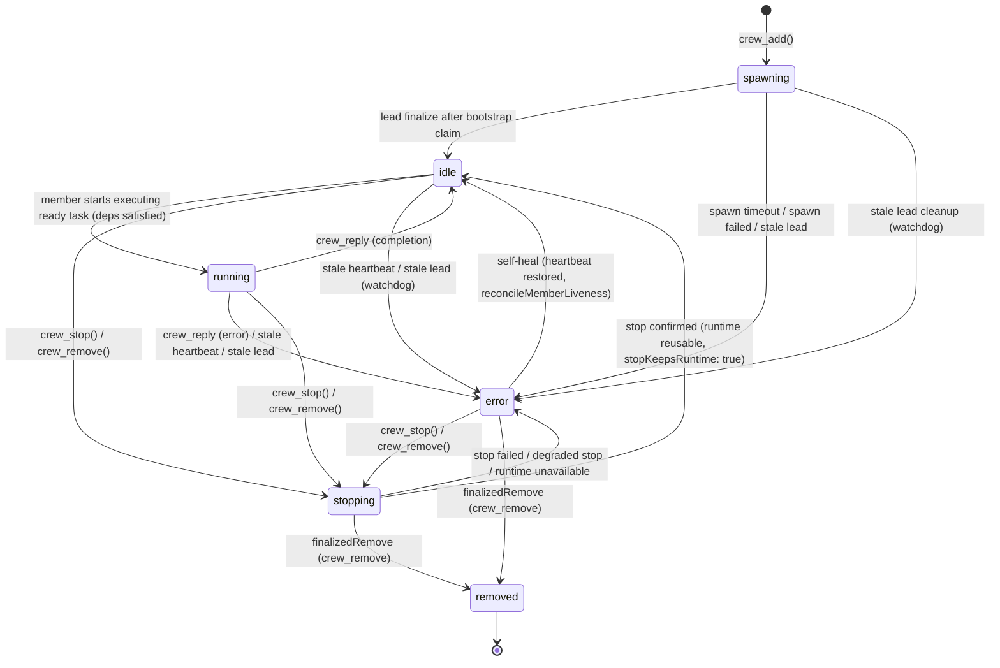
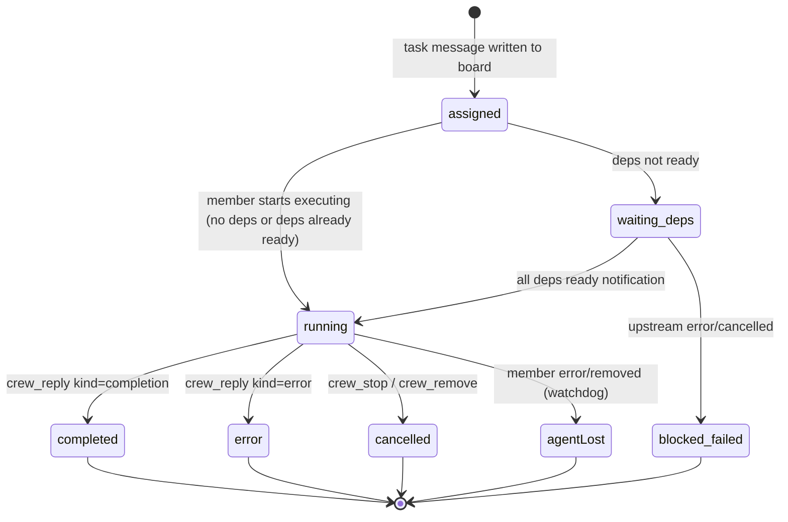

# Crew Extension Architecture

## 1. Module Structure

| File | Responsibility |
|------|---------------|
| `index.ts` | Extension entry point (~309 lines). Defines `RoomExtensionOptions` interface and `roomExtension()` function: registers `crew` tools, wires session lifecycle event hooks (`session_start`, `before_agent_start`, `turn_start`, `turn_end`, `session_shutdown`), orchestrates room resolution and shutdown. Heavy logic is delegated to lifecycle/tools/storage. |
| `lifecycle.ts` | Room lifecycle management. `ActiveRoomContext` interface, active room registry (`getActiveRoom`, `setActiveRoom`, `clearActiveRoom`), room activation (`activateBootstrapRoom`), message polling loop (`startPolling`, `processUnreadMessages`), heartbeat loops (`startOwnerHeartbeat`, `startMemberHeartbeat`), session resolution (`resolveAccessibleRoom`, `getSessionId`), grace-period helpers, test resets. |
| `tools.ts` | Tool handler functions. `executeCrewMgmtTool()` handles add/stop/remove/roles, `executeCrewCommTool()` handles tell/reply/messages/read/who/tasks. Shared helpers: `resolveRoomAndSession`, `textResult`, `ownerOnlyError`, `isNonEmptyString`, `extractSummaryMentions`, `selectSpawnAdapter`, `getAdapterForBackend`, `trackActiveRoomTask`. |
| `schemas.ts` | Tool JSON Schema constants: `CrewMgmtToolSchema`, `CrewCommToolSchema`, `RoomToolSchema`. Extracted from index.ts to keep schemas separate from logic. |
| `types.ts` | All TypeScript type definitions: `RoomState`, `RoomMemberLifecycleState`, `RoomSpawnJobState`, `RoomMessageKind`, `RoomMetadata`, `RoomMemberState`, `RoomSpawnJob`, `RoomMessage`, `RoomBootstrap`, `RoomExecutionContext`, `RoomToolParams`, `SpawnMemberRequest`, `SpawnMemberResult`, `RoomSpawnAdapter`. `RoomMemberState.name` is the persisted internal id and `displayName` is the user alias. |
| `storage.ts` | Persistence layer. Room layout creation, JSON file I/O with atomic writes, message board CRUD, member state management, spawn job management, room creation/lookup, mutation locking. |
| `spawn.ts` | Backend adapters for spawning subagents. Implements `createPiMemberAdapter()` (direct process spawn) and `createPaseoPiMemberAdapter()` (Paseo daemon RPC). Includes process lifecycle helpers and system prompt materialization. |
| `watchdog.ts` | Liveness monitoring. Owner heartbeat write, member heartbeat reconciliation, spawn timeout detection, stale owner detection for members, room reaping. Defines all env-var-based interval/stale constants. |
| `worktree.ts` | Git worktree primitives. Creates per-member-lifecycle branches/worktrees, persists fixed snapshot commits, and removes worktrees during cleanup. |
| `worktree-cleanup.ts` | Shared stop/remove/watchdog cleanup archival helper. Clears `member.worktree` and writes best-effort `worktreeResult` fallback metadata without overriding terminal snapshot priority. |
| `task-terminal.ts` | Shared terminal closure helper for `completion` / `error` / `cancelled`. Keeps stop, watchdog, `crew_reply`, and mutation-proxy dependency updates on the same lead-authoritative closure path. |
| `lock.ts` | File-based mutex implementation (`withFileLock`). Token-based lock ownership, heartbeat-based staleness detection, automatic renewal, cross-host safety via hostname comparison. |
| `bootstrap.ts` | Room bootstrap block parsing/generation. Extracts `RoomBootstrap` from system prompts, builds member system prompts from skill templates. Hides the `<!-- PI_ROOM_BOOTSTRAP ... -->` block from agents. |
| `dispatch.ts` | Message delivery and state machine transitions. `deliverRoomMessage()` sends to the agent UI, `applyIncomingMessageState()` / `applyOutgoingMessageState()` manage state transitions for task assignment, completion, error, and cancellation. |
| `logger.ts` | Structured JSON-line logger. Append-only WritableStream pooled by room log path. Level filter: `silent` | `default` | `debug`. Falls back to stderr when no roomDir. |
| `errors.ts` | Typed error hierarchy. `RoomError` base class with machine-readable `code`, plus `RoomNotFoundError`, `MemberNotAvailableError`, `SpawnFailedError`, `LockTimeoutError`, `BootstrapTokenError`, `RoomNotClaimableError`, `ValidationError`, `MemberAlreadyExistsError`. |

## 2. Data Flow: Owner Spawn → Bootstrap → Join → Message Delivery



## 2.1 Identity And Terminal Closure Model

- `RoomMemberState.name` is the internal persisted id, such as `explorer_1234`. It is used for files, routing, worktree names, bootstrap, and message `from`/`to` fields.
- `RoomMemberState.displayName` is the user alias, such as `explorer`. User-facing output renders a copy-pasteable label like `explorer#1234` via `formatMemberLabel()`.
- Direct tool targets resolve from alias, internal id, or `alias#suffix` label through `resolveMemberTarget()` before any mutation.
- `crew_merge` uses `resolveMemberTargetForMerge()`: active members still win normal alias resolution, but archived removed members remain reachable for merge when no active target matches or when the caller supplies the exact internal id / label.
- Duplicate active aliases are rejected at spawn time. Error/stopped/lost members keep their alias reserved until explicit `crew_remove`.
- `task-terminal.ts` is the single closure path for terminal task outcomes. `crew_reply`, `crew_stop`, watchdog `agentLost`, and mutation-proxy dependency updates all converge on `markTaskClosed -> setTaskState -> notifyDependentsIfAllReady`.
- Dependency notifications are deduped in memory and on disk so repeated terminal closure attempts or owner-side dependency-state rebuilds do not fan out duplicate downstream notices.
- Mergeable work is represented by fixed snapshot OIDs: `pendingTerminalReply.snapshotOid`, `lastSnapshotOid`, and archived `worktreeResult.snapshotOid`.
- Merge priority is strict: pending terminal snapshot > last terminal snapshot > archived snapshot > cleanup-only fallback.

## 3. RoomMemberLifecycleState State Machine



**Key rules**:
- `stopping` is set only by the lead (via `crew_stop()` or `crew_remove()`). It is a transitional state.
- `removed` is set only by explicit `crew_remove()` after adapter cleanup.
- `crew_stop`, `crew_remove`, and watchdog teardown may archive dirty worktree state into `worktreeResult`, but they must not replace `lastSnapshotOid` as the default merge target.
- Watchdog may clean up dead runtimes or worktrees for `agentLost` members, but it keeps the member in `error` so the alias remains reserved until explicit removal.
- `idle` + `currentTaskMessageId != null` is a valid state: the member holds a task but has not yet started execution (e.g. waiting for dependencies). Task assignment no longer forces an immediate `idle → running` transition — the member transitions to `running` only when it actually begins executing.

**Self-healing**: Error-state members self-heal only when liveness is authoritative for the current backend. For `pi`, that means heartbeat plus PID evidence. For `paseo`, that means a daemon-authoritative positive result for the same member generation. Self-healing only occurs in rooms whose metadata `state` is `"active"`.

### 3.1 Three-Layer State Model

The crew extension implements a three-layer state architecture:

| Layer | Name | Storage | Values | Consumed by |
|-------|------|---------|--------|-------------|
| 1 | Raw lifecycle state | Persisted (`RoomMemberState.state`) | `spawning` / `idle` / `running` / `stopping` / `error` / `removed` (6 values) | Dispatch, watchdog, spawn |
| 2 | Derived display state | Read-only (computed) | Layer 1 states + `assigned` / `waiting_deps` / `blocked_failed` / `chatting` (10 values) | `crew_who` output |
| 3 | Derived task status | Read-only (computed) | `assigned` / `waiting_deps` / `blocked_failed` / `running` / `completed` / `error` / `cancelled` / `agentLost` (8 values) | `crew_tasks` output |

**Layer 1 (Raw lifecycle state)** is the single source of truth for persistence and dispatch. It uses only 6 values, unchanged from the original schema. Its semantics are:

| State | Meaning |
|-------|---------|
| `spawning` | Agent is being created or awaiting bootstrap claim |
| `idle` | Agent is alive but not currently executing a ready task (may hold an unclosed task waiting for deps) |
| `running` | Agent is actively executing a ready task |
| `stopping` | Agent is being terminated |
| `error` | Agent is degraded or unavailable |
| `removed` | Agent has been permanently removed |

**Layer 2 (Derived display state)** enriches `crew_who` output without modifying persistence. It is computed by `deriveMemberDisplayState()` with this priority order:
1. Lifecycle states (`removed`/`stopping`/`error`/`spawning`) → passthrough
2. `member.state === "running"` → `running`
3. `idle` + `chatBusy` → `chatting`
4. `idle` + `currentTaskMessageId` → derive from task status: `blocked_failed` / `waiting_deps` / `assigned`
5. Otherwise → `idle`

`crew_who` output exposes only `state` (the derived display state). The raw lifecycle state is an implementation detail and is not included in the output.

**Layer 3 (Derived task status)** is computed by `deriveTaskStatus()` with this deterministic priority order:
1. Terminal reply (completion/error/cancelled) → `completed` / `error` / `cancelled`
2. Member lost and no longer holds task → `agentLost`
3. Has `{input:#N}` deps and any upstream is already `error` / `cancelled` → `blocked_failed`
4. Has `{input:#N}` deps and any upstream is still pending → `waiting_deps`
5. Member holds task but raw state is still `idle` → `assigned`
6. Otherwise → `running`

### 3.1.1 Phase 1 / Phase 2 Dependency Scope

- **Phase 1 (implemented):** owner-created directed tasks register dependencies in the owner-authoritative `depIndex` via `crew_tell` / `crew_reply`. These tasks participate fully in `waiting_deps`, `blocked_failed`, dependency-ready notifications, and the delayed `Starting:` transition.
- **Phase 2 (not yet implemented):** member-originated dependent tasks do not automatically populate the owner-authoritative dependency index yet. Until a dedicated proxy/forwarding registration path lands, those tasks are outside the guaranteed scope for dependency-derived state and notification behavior.

### 3.2 Invariants (I1–I6)

These invariants govern the three-layer state model:

| ID | Invariant |
|----|-----------|
| **I1** | `member.state === "running"` means the member is executing a **ready** task — not chatting, not waiting for deps, not merely having received a task |
| **I2** | `member.currentTaskMessageId !== null` means an unclosed task exists; the combination with `member.state === "idle"` is legal (e.g. waiting for deps) |
| **I3** | `crew_tasks` status derivation is deterministic: a given task resolves to exactly one status at any moment |
| **I4** | If any upstream dependency has error/cancelled and the remaining deps cannot all become ready, the task must not display as `running` |
| **I5** | Layer 2 display state is presentation-only; it never modifies persistent schema |
| **I6** | Rollback requires no disk data migration — only reverting the derivation and gating logic |

### 3.3 Upstream Failure Propagation (`blocked_failed`)

When a task enters a terminal failure state (`error` or `cancelled`), the dependency pipeline in `deps.ts` ensures downstream tasks become observably blocked:

- **Does not wait** for remaining dependencies to complete — notification is immediate
- **Deduplication**: uses two cross-checked in-memory dedup sets (`notifiedBlockedTasks` for the early blocked path, `notifiedReadyTasks` for the all-deps-resolved path) plus a disk-based `hasExistingDependencyNotification()` check. When the all-deps-resolved path fires with `hasCancelled || hasError`, it also checks `notifiedBlockedTasks` before appending, so a downstream task receives exactly one failure notification even if multiple upstreams fail across both paths.
- **Content**: notification messages are sent as `kind: "info"` from `"system"` to the downstream member with targeted dependency summaries (`"Dependency failed …"` / `"Dependency cancelled …"`), whether they come from the early blocked path or the all-deps-resolved failure path
- **Result**: `crew_tasks` can derive `blocked_failed` status for the downstream task without polling, and `crew_who` reflects `blocked_failed` in the member's display state
- **Already-resolved guard**: if all upstream deps are already resolved (including other failures), the propagation is skipped — `notifyDependentsIfAllReady` handles that case

### 3.4 Task Status State Machine



## 4. File Layout

```
runtime/rooms/{roomId}/
├── room.json                  # RoomMetadata: roomId, ownerName, ownerSessionId, ownerPid, cwd, createdAt, state, nextSeq
├── heartbeat.json             # Owner heartbeat: roomId, ownerSessionId, ownerPid, updatedAt
├── agent.log                  # Structured JSON-line log (append-only, pooled stream)
├── members/
│   └── {memberName}.json      # RoomMemberState per member
├── messages/
│   └── {10-padded-seq}-{uuid}.json  # Individual RoomMessage files (sorted lexicographically by seq)
├── jobs/
│   └── spawn-{taskId}.json    # RoomSpawnJob records (starting → external_created → claimed → completed, plus timed_out_pending_* tombstones)
├── heartbeats/
│   └── {memberName}.json      # Member heartbeat: memberName, updatedAt, pid (independent from member state)
└── locks/
    ├── mutation.lock          # Serializes all room state mutations
    ├── cleanup.lock           # Serializes room reaping
    └── (temporary).lock.heartbeat  # Lock renewal heartbeat files
```

### Top-level lock

```
runtime/rooms/locks/
└── owner-{hex(sessionId)}.lock   # Serializes room creation per owner session
```

## 5. Concurrency Model

### File Locks (`lock.ts`)

The subagent extension uses **file-based mutexes** (`withFileLock`) for all critical sections:

- **Room creation**: `owner-{hex}.lock` — prevents double-creation per owner session.
- **Room mutations**: `mutation.lock` — serializes all message appends, member state writes, spawn job updates.
- **Room cleanup**: `cleanup.lock` — serializes room reaping.

**Lock mechanism**:
1. `fs.open(lockPath, "wx")` — exclusive create (fails with `EEXIST` if already held).
2. On success, writes a payload: `{ pid, hostname, createdAt, roomId, token }`.
3. Renews via a heartbeat file (`{lockPath}.{token}.heartbeat`) every `staleMs / 2` interval.
4. On staleness: if same host → check process alive via `process.kill(pid, 0)`; if different host → compare heartbeat timestamp against `staleMs` (default 5000ms).
5. On release: atomically removes lock file and heartbeat file if token matches.

### Atomic Writes (`storage.ts`)

All JSON writes use `writeJsonAtomic` which:
1. Creates parent directories if needed.
2. Writes to a temp file: `{path}.{randomUUID()}.tmp`.
3. Renames temp file to final path (`fs.rename` is atomic on POSIX).
4. This prevents readers from seeing partial/truncated writes.

### Heartbeat Renewal

- **Owner heartbeat**: Written on `setInterval` every `PI_ROOM_OWNER_HEARTBEAT_INTERVAL_MS` (default 1000ms). Deduplication prevents overlapping concurrent writes via `pendingHeartbeat` guard.
- **Member heartbeat**: Written on `setInterval` every `PI_ROOM_MEMBER_HEARTBEAT_INTERVAL_MS` (default 1000ms), same dedup pattern.
- Both heartbeat intervals are `unref()`d so they don't keep the process alive.

### Polling Model

The poll cycle (200ms interval) performs:
1. **Owner**: `reconcileSpawnTimeouts()` + `reconcileMemberLiveness()`.
2. **Member**: `handleStaleOwnerForMember()` (cleanup if owner dead).
3. **Both**: `processUnreadMessages()` — scan messages after `lastSeenSeq`, deliver steer messages, apply state transitions.

All poll operations are serialized per session — `pendingPoll` guard ensures only one poll runs at a time.

### Message Writing Deadlocks

`appendMessage()` acquires `mutation.lock` and may call `writeRoomMemberState()` (same lock already held). The lock is non-reentrant by design, so all mutation-wrapped functions are composed to avoid nested locking. Any function called inside a lock must not re-acquire the same lock.

## 6. Backend Adapters

Two backends implement the `RoomSpawnAdapter` interface:

| Property | `pi` adapter | `paseo` adapter |
|----------|-------------|-----------------|
| `kind` | `"pi"` | `"paseo"` |
| `stopKeepsRuntime` | `false` (process is killed) | `true` (agent persists on daemon) |
| `spawn()` | Spawns `pi --mode rpc --extension room` as a child process. Manages process lifecycle (exit handler, temp prompt cleanup). | Connects to Paseo daemon via `connectToDaemon()`, calls `createAgent()` with system prompt + initial prompt. |
| `stop()` | Sends SIGTERM, waits 500ms, falls back to SIGKILL if needed. | Calls daemon's `cancelAgent()`. Timeout-tolerant: treats RPC timeouts as degraded stop (runtime is likely already cleaned up). |
| `remove()` | Like stop but with longer grace (500ms) and forces SIGKILL. | Calls daemon's `deleteAgent()`. |
| `isAvailable()` | Always returns `true`. | Checks if Paseo CLI is on PATH, probes daemon connectivity with a quick connect/close. |

### Adapter Selection

```typescript
async function selectSpawnAdapter(ctx: RoomExecutionContext, adapters): Promise<RoomSpawnAdapter> {
  if (ctx.hasUI) return adapters.pi;           // UI sessions always use pi
  const paseoAvailable = await adapters.paseo.isAvailable?.(ctx);
  if (paseoAvailable) return adapters.paseo;    // Prefer paseo if available
  return adapters.pi;                           // Fall back to pi
}
```

### Liveness Implications

- **pi backend**: `runtimeId` is the child process PID. Liveness is verified with heartbeat freshness plus `process.kill(pid, 0)`.
- **paseo backend**: `runtimeId` is the daemon agent ID. Liveness is daemon-authoritative via `fetchAgent()`. Heartbeats are only freshness hints and cannot override a positive daemon result or invent a replacement runtime identity.
