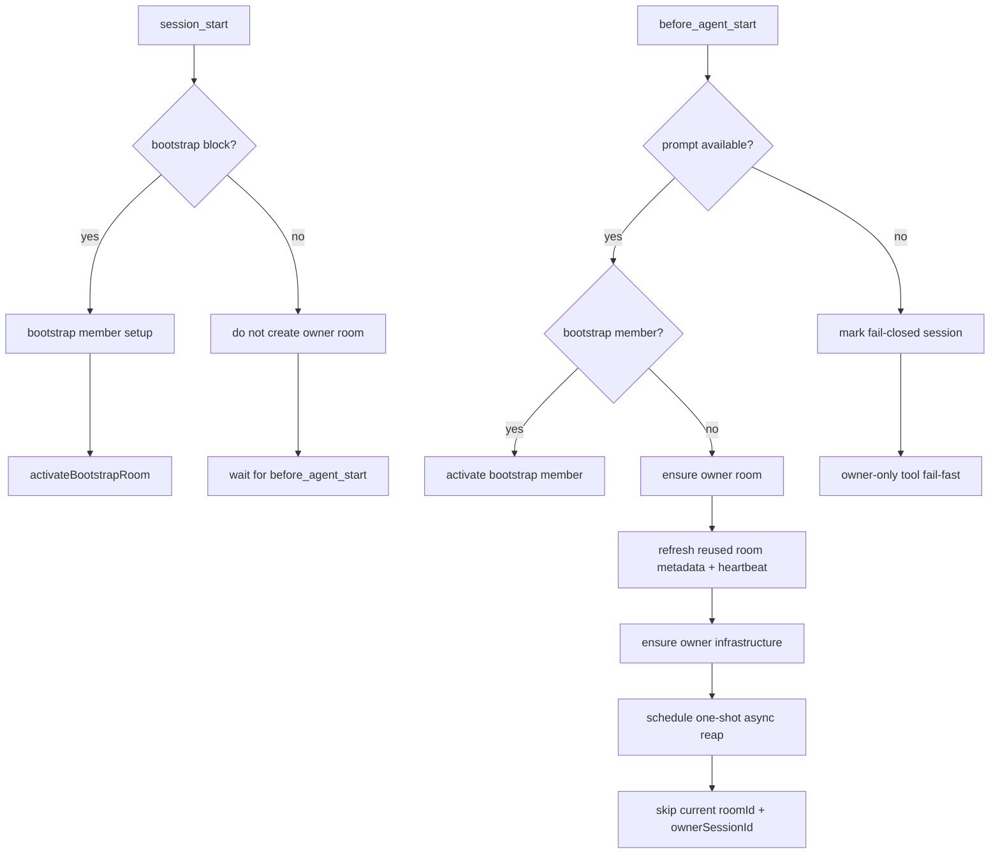

# Owner Room Lifecycle And Async Reap

这次变更把 owner room 生命周期从“`session_start` 上的乐观推断”改成了“`before_agent_start` 上的显式 materialization”，并把 stale room 回收从启动热路径挪到了单次后台调度。

## 结果概览

- `session_start` 现在只负责 bootstrap/member 侧初始化，不再创建或复用 owner room。
- `before_agent_start` 会先解析 `event.systemPrompt ?? ctx.getSystemPrompt()`；只有拿到可解析 prompt 且不是 bootstrap member 时，才会解析/创建 owner room。
- 如果两个 prompt 来源都不可用，session 会 fail-closed。owner-only tools 会直接报 owner room 未初始化/owner classification unavailable，而不会在 fail-closed 状态下通过索引补 recover。
- 新建 owner room 时，会在 `before_agent_start` 同步写入首条系统 board message，把 room id 初始化到消息板上。
- storage 现在维护 `ownerSessionId -> roomId` 索引。索引命中会先校验目标 room；失效或命中 stale room 时回退扫描并自修复。
- owner 复用已有 room 时，会先把 metadata `state` 刷回 `active`、把 `ownerPid` 刷到当前进程，并同步写入一条新的 owner heartbeat。
- 已完成 owner classification 的 session 如果丢失了内存中的 activeRoom，会通过同一个 owner helper 恢复已有 room，并补齐 proxy、polling、heartbeat。
- stale room 回收改成 owner 基础设施就绪后的单次后台扫描。扫描显式跳过当前 `roomId` 和当前 `ownerSessionId`，`reapRoom()` 会在 cleanup lock 内再次确认 stale 后才删除，并清理 owner 索引。

## Lifecycle Flow

## Owner Index Rules

- 索引文件位于 runtime root 下的 `owners/` 目录，以 `ownerSessionId` 的十六进制编码命名。
- `findRoomByOwnerSessionId()` 的主路径先读索引，再校验目标 room 是否仍存在且 metadata 中的 `ownerSessionId` 仍匹配。
- 如果索引失效，或者索引命中的 room 不再满足 `active + fresh heartbeat`，查找会回退一次目录扫描并修复索引。
- duplicate repair 的 winner 规则是：先选 `active + fresh heartbeat`，其余并列候选按字典序最小 `roomId` 选主。

## Reap Rules

- owner 启动完成后只触发一轮后台 reap，不维持常驻 janitor。
- 这轮 reap 显式跳过当前 owner `roomId` 和当前 owner `ownerSessionId`，防止误删当前 live room 以及当前复用链路上的 stale duplicate。
- `reapRoom()` 会在 cleanup lock 内重新读取 metadata/heartbeat，再确认一次 stale 条件；fresh room 即使被错误传入也不会被删除。
- 真正删除 room 目录前，会同步清理 owner 索引，避免后续 lookup 命中脏映射。

## Residual Risk

- 由于 reap 改成后台触发，orphan room 会在 owner 启动后稍晚一点被清掉；这是本轮接受的短暂脏状态窗口。
- owner 索引仍然保留扫描修复兜底，所以极端脏数据场景下仍有一次目录扫描成本；这比原先的主路径全扫和同步 reap 已明显收敛。