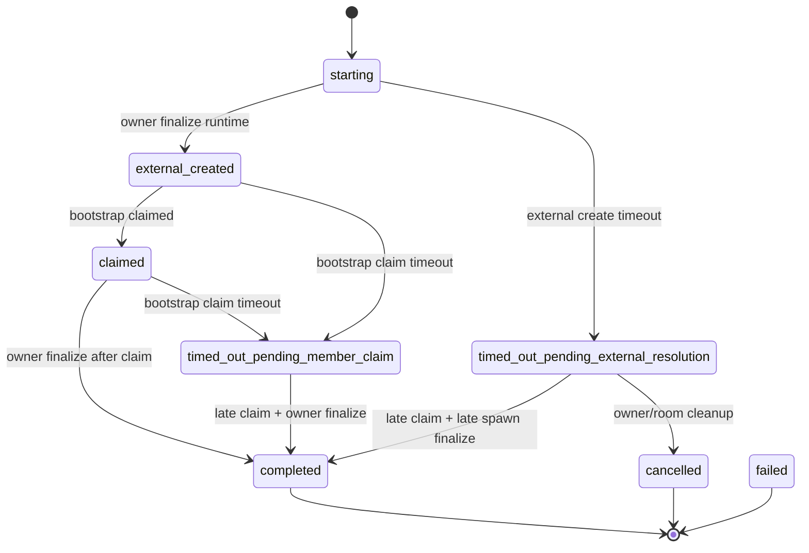

# Paseo Spawn And Watchdog Maintenance Notes

## Summary

- Owner is the only authority allowed to persist a paseo `runtimeId`.
- Member bootstrap only claims session ownership; it must never write `process.pid` into paseo `runtimeId`.
- Spawn jobs now move through explicit phases so slow external creation and late bootstrap claims no longer collapse into a single 15s failure path.
- Paseo liveness is daemon-authoritative. Heartbeats are only freshness hints and never override a positive daemon result.

## Spawn Contract

## Runtime Identity Rules

- `createPaseoPiMemberAdapter().spawn()` returns the external `agentId` but does not write member state.
- `finalizeMemberRuntime()` is the only path that writes paseo `runtimeId` to both member and spawn job records.
- `claimMemberSession()` records `sessionId`, `bootstrapClaimedAt`, and optional member pid metadata, but leaves paseo `runtimeId` untouched.
- Legacy `mark_member_joined` compatibility for paseo is reduced to claim-only semantics. Mixed-version members cannot smuggle a pid into `runtimeId`.

## Liveness Rules

- Paseo uses daemon `fetchAgent` as the authoritative liveness source.
- `alive` from daemon keeps the member live even if heartbeat is stale or missing.
- `closed`, `archived`, or `not found` from daemon are authoritative dead signals.
- RPC timeout or transport failure is treated as inconclusive. Watchdog must not convert that directly into dead.
- Self-heal only runs from `error -> idle` when the daemon result is authoritative and the current member generation still matches the observed session or bootstrap claim.
- Once watchdog has both an authoritative dead result and a successful runtime cleanup with no recovery, it also reclaims the member worktree.
- If that worktree contains changes, watchdog commits them to the member branch with an `agentlost auto-cleanup` message before removing the worktree. The commit is intentionally marked as possibly incomplete.

## Timeout Rules

- `PI_ROOM_SPAWN_JOIN_TIMEOUT_MS` still governs `pi` spawn timeout behavior.
- `PI_ROOM_PASEO_EXTERNAL_CREATE_TIMEOUT_MS` defaults to 45000ms and moves paseo `starting` jobs to `timed_out_pending_external_resolution`.
- `PI_ROOM_PASEO_BOOTSTRAP_CLAIM_TIMEOUT_MS` defaults to 15000ms and moves paseo `external_created` or `claimed` jobs to `timed_out_pending_member_claim`.
- Timeout tombstones keep the member file in place. Watchdog does not delete or fail the member just because paseo is slow.
- Timeout tombstones are recovery markers, not dispatchable spawning states. Directed delivery must reject `timed_out_pending_external_resolution` and `timed_out_pending_member_claim` until owner either finalizes or cleans them up.

## Late Success Cleanup

- Task 0 locked paseo recovery to the fallback contract: no label scan or orphan rediscovery is available.
- If `adapter.spawn()` resolves after a job already moved to `timed_out_pending_external_resolution`, owner first checks whether the same generation has already claimed bootstrap. Claimed generations finalize; unclaimed generations are treated as late cleanup.
- For unclaimed generations, owner reserves cleanup inside the mutation boundary before the external `remove()` call: the job becomes non-claimable and the member enters a non-dispatchable cleanup state.
- When that cleanup succeeds, owner closes the stale spawn attempt in the same authority boundary: the spawn job remains `cancelled` and the member moves to retryable `error` with `spawnTaskId`, `runtimeId`, and `sessionId` cleared.
- If cleanup fails, the cancelled job and error member keep the late runtime handle so operators still have an authoritative cleanup target.
- This path emits `late spawn success cleaned up` so operators can distinguish normal cleanup from false-negative failure.

## Structured Events

- `spawn phase transition`
- `bootstrap claimed`
- `runtime finalized by owner`
- `late spawn success cleaned up`
- `paseo liveness authoritative positive`
- `paseo liveness inconclusive`

These events are emitted from `storage.ts`, `watchdog.ts`, and `tools.ts` with `memberName`, `taskId`, `backend`, and phase details where available. The high-frequency watchdog tick and healthy/inconclusive paseo liveness events default to debug so they do not drown transition and failure signals in normal logs.