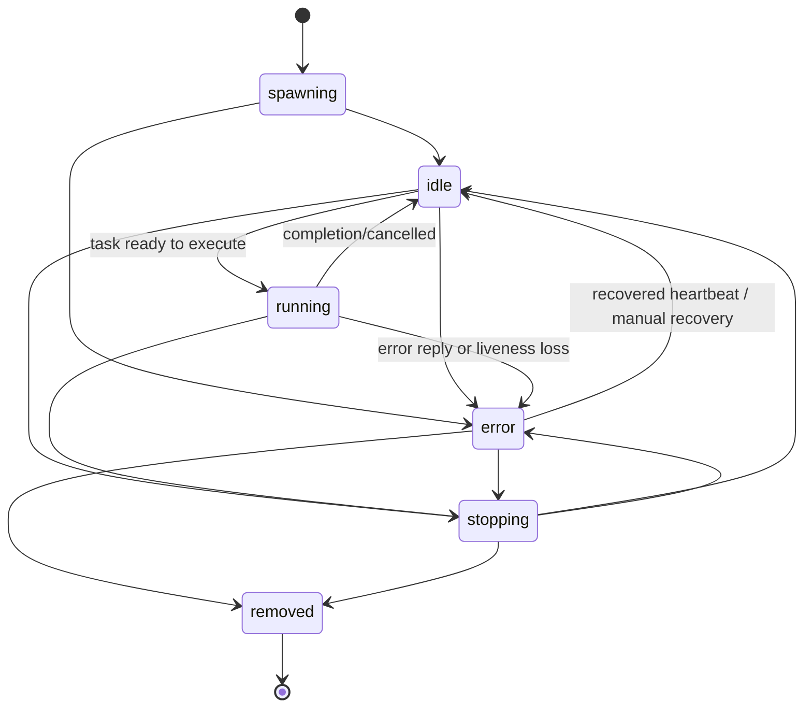
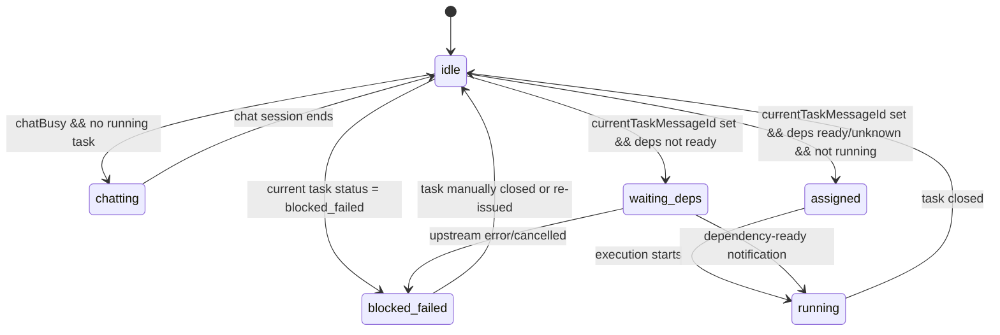
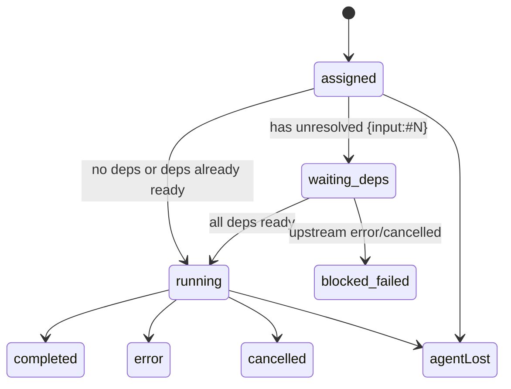

<!-- markdownlint-disable-file -->

# Crew Member / Task 状态正确性优化方案

**Status:** Implemented on 2026-05-06.

**Implementation notes:** Verified by the scoped implementation in `extensions/crew/dispatch.ts`, `extensions/crew/lifecycle.ts`, `extensions/crew/storage.ts`, `extensions/crew/tools.ts`, and the focused regressions in `extensions/crew/dispatch.test.ts` plus `extensions/crew/state-derivation.test.ts`. Public docs were synchronized in `extensions/crew/docs/api.md` and `extensions/crew/docs/architecture.md`.

> **基于**: `extensions/crew/docs/plans/2026-05-06-task-member-state-separation.md`
>
> **目标**: 在不引入新的持久化 task 状态字段、不要求 agent 主动汇报中间态的前提下，让 crew 的 member 和 task 状态同时具备**正确性**、**可观测性**和**可回滚性**。

## 0. 摘要

当前 crew 插件把两类本应正交的信息压在一起：

1. `member.state` 既承担“agent 是否存活/可调度”的生命周期语义，又被当作“task 是否已开始执行”的进度语义使用。
2. `crew_tasks` 只能输出 `running/completed/error/cancelled/agentLost` 五种状态，无法表达“任务已收到但未执行”“等待依赖”“被上游失败阻塞”等关键中间态。

结果是：**真实系统里存在的状态，在工具输出里不存在；工具输出里显示为 `running` 的对象，实际却可能在聊天、等待依赖，甚至已经不可能继续执行。**

本方案延续参考文档“member 生命周期状态与 task 派生状态分离”的主方向，并在以下方面补强：

- 明确 raw lifecycle state、display state、derived task state 三层语义边界
- 增加实现级不变量，避免 reviewer 认为只是“展示层 hack”
- 把依赖等待、上游失败、聊天占用、task gating、`agentLost` 的边界写清楚
- 增加回滚路径、兼容性约束、分阶段落地顺序与测试矩阵

**核心决策**：

- 不扩展 `RoomMemberLifecycleState` 枚举；member 原始状态仍只保留 lifecycle 语义
- task 中间态保持**纯推导**，不落盘
- 依赖通知里使用的 task `seq` 与 member 持有的 `currentTaskMessageId` 通过只读解析 helper 对齐，不新增持久化字段
- `crew_who` 输出 derived display state；`crew_tasks` 输出 expanded derived task status
- 新 task 分配门槛只看“是否存在未闭合 task”，不再把 `member.state === "running"` 当作唯一阻塞信号
- `error` member 不视为 task-reachable；必须先恢复到 `idle` 才能重新接收新 task

## 1. 现状与问题归纳

### 1.1 当前状态模型

当前代码中可见的原始状态定义如下：

```typescript
type RoomMemberLifecycleState =
  "spawning" | "idle" | "running" | "stopping" | "error" | "removed";
```

见 `extensions/crew/types.ts:3` 与 `extensions/crew/types.ts:35-74`。

而 `crew_tasks` 当前可筛选的任务状态只有：

```typescript
status: ["running", "completed", "error", "cancelled", "agentLost"]
```

见 `extensions/crew/schemas.ts:148-156`，以及 `extensions/crew/types.ts:137-141`。

这意味着系统表面上只有一条粗糙轨道：

```text
member: spawning → idle → running → stopping → error → removed
task:   running → completed | error | cancelled | agentLost
```

### 1.2 症状 A：依赖等待不可观测

`applyIncomingMessageState()` 在收到任何定向 task 时，都会立刻把 member 置为 `running`：

```typescript
if (message.kind === "task") {
  return {
    ...member,
    state: "running",
    currentTask: message.summary,
    currentTaskMessageId: message.id,
  };
}
```

见 `extensions/crew/dispatch.ts:96-108`。

但当前依赖系统已经具备如下能力：

- `extractInputDeps()` 解析 `{input:#N}` 占位符（`extensions/crew/deps.ts:133-141`）
- `registerDeps()` 记录依赖图（`extensions/crew/deps.ts:166-185`）
- `allDepsReady()` 判断依赖是否全部满足（`extensions/crew/deps.ts:236-262`）
- `notifyDependentsIfAllReady()` 在上游完成后通知下游（`extensions/crew/deps.ts:273-320`）

即：**底层已能识别“等待依赖”，但状态层完全没有把它表达出来。**

实际表现为：

1. agentB 收到包含 `{input:#100}` 的 taskB
2. memberB 立即被写成 `running`
3. `crew_who` 看到 `running`
4. `crew_tasks` 对无终态回复的任务统一视作 `running`
5. 观察者无法区分 “agent 正在执行” 与 “agent 只是收到了任务、仍在等待依赖”

### 1.3 症状 B：`chatBusy` hack 暴露模型混淆

`executeCrewWho()` 当前有这段逻辑：

```typescript
const state = (member.chatBusy && member.state === "idle") ? "running" : member.state;
```

见 `extensions/crew/tools.ts:1912-1914`。

这说明代码已经在用“展示层伪装”修补模型空缺：

- `idle + 正在对话` 被展示成 `running`
- 但这不是 task-running，只是 chat 占用
- 也不是 lifecycle-running，因为 member 并没有开始执行一个 task

这段 hack 证明两个事实：

1. 当前系统需要一个“不是 idle，但也不是 task 真执行”的状态表达
2. 当前状态域没有为此建模，只能把不同语义都映射成 `running`

### 1.4 症状 C：task 分配门槛用错了信号

`assertTaskTargetAvailable()` 目前这样拦截新任务：

```typescript
if (target.state === "running" || target.currentTaskMessageId || target.currentTask) {
  throw new MemberNotAvailableError(target.name, "already running a task");
}
```

见 `extensions/crew/storage.ts:1492-1496`。

这里把三种不同含义混在一起了：

- `target.state === "running"`：生命周期层的“运行中”
- `currentTaskMessageId`：存在未闭合 task
- `currentTask`：当前 task 摘要文本

问题在于，真正阻止新 task 的应该是**“是否还有未闭合 task”**，而不是生命周期状态本身。

否则会出现两个错误方向：

1. **误拦截**：member 因聊天或恢复中的显示/生命周期状态为 `running`，却没有未闭合 task，也会被拒绝新 task
2. **误表达**：代码只能依赖 `running` 判断“忙不忙”，被迫继续扩大 `running` 的语义污染

### 1.5 症状 D：`crew_tasks` 对非终态 task 全部压平为 `running`

`executeCrewTasks()` 现有逻辑是：

1. 找到 reply，则输出 `completed/error/cancelled`
2. 如果没有 reply，再检查 member 是否 `removed/error` 且已不持有当前 task，若是则输出 `agentLost`
3. 否则一律输出 `running`

见 `extensions/crew/tools.ts:1971-2001`。

这直接导致以下状态被压平：

- 任务已写入 board、member 尚未开始执行
- member 拿到任务但正在等待依赖
- 上游失败导致本任务永远不可能继续
- room 级 task（`to === "room"`）和 member task 共享相同的“非终态 = running”规则

### 1.6 根因总结

根因不是“少几个 if/else”，而是**状态语义边界不清**：

| 维度 | 应表达的问题 | 当前承载者 | 结果 |
|------|--------------|------------|------|
| Member lifecycle | agent 是否存活、是否可接收消息、是否已停止/故障 | `member.state` | 正常 |
| Member display | 对用户展示“聊天中/等依赖/已分配”等状态 | `member.state` + hack | 混淆 |
| Task progress | task 是否已分配、等待依赖、运行中、被上游阻塞、已结束 | `crew_tasks` 简化推导 | 丢失中间态 |

因此方案必须同时解决**模型边界**与**展示/推导逻辑**，否则只改 `crew_who` 或只改 `crew_tasks` 都会留下新的错配。

## 2. 目标、约束与验收标准

### 2.1 目标

1. **让 member raw state 重新只表达 lifecycle。**
2. **让 task status 可以正确表达等待依赖、阻塞失败、已分配未执行等关键中间态。**
3. **让 `crew_who` 和 `crew_tasks` 对同一事实给出互相一致、可解释的视图。**
4. **保持 agent 端协议简单：agent 仍只需要关闭 task，不需要主动上报中间态。**

### 2.2 约束

1. 不新增 task 持久化字段，不引入磁盘迁移。
2. 不扩展 `RoomMemberLifecycleState` 原始枚举，避免大面积 ripple。
3. 不新增 `crew_reply` kind；终态仍只使用 `completion/error/cancelled`。
4. 尽量复用现有依赖索引与 readiness 逻辑，不重写 `deps.ts` 主体。
5. 需要明确区分 **Phase 1（owner 创建的 directed task）** 与 **Phase 2（member 创建的 dependent task）** 的覆盖范围，不能默认两者天然等价。

### 2.3 验收标准

只要满足以下四条，即视为方案达标：

1. 下游 task 在依赖未满足时，`crew_tasks` 不再显示 `running`。
2. member 在等待依赖时，`crew_who` 不再显示与真实执行中完全相同的 `running`。
3. 上游 task error/cancelled 后，下游 task 能稳定落到一个可观测的非运行终态。
4. 是否允许新 task 分配，只由“未闭合 task 是否存在”与 lifecycle reachability 决定，而不是被展示态误导。

## 3. 参考系统与可借鉴点

### 3.1 Celery：Task 与 Worker 彻底分离

```text
Task:   PENDING → RECEIVED → STARTED → SUCCESS/FAILURE/RETRY/REVOKED
Worker: independent heartbeat / active / offline
```

可借鉴点：

- `RECEIVED` 与 `STARTED` 分离，说明“收到任务”和“开始执行”不是同一状态
- worker 活性和 task 进度天然是两个正交维度

**对应到 crew：**

- `assigned` / `waiting_deps` 属于 task 维度
- `spawning/idle/running/stopping/error/removed` 保持在 member lifecycle 维度

### 3.2 Airflow：等待外部条件有专门状态

```text
scheduled → queued → running
          ↘ deferred
running   ↘ upstream_failed
```

可借鉴点：

- `deferred` 精确表示“没在运行，但未来还有机会恢复”
- `upstream_failed` 精确表示“不是我自己执行失败，而是上游已经让本任务无法继续”

**对应到 crew：**

- `waiting_deps`：等待上游满足
- `blocked_failed`：上游已 error/cancelled，当前 task 不再可执行

### 3.3 LLM agent scheduler literature：waiting_human / blocked 显式建模

不少 agent orchestration 论文都会把以下状态显式区分：

- `ready`
- `running`
- `waiting_human`
- `blocked`

这对 crew 的启发是：**聊天占用与 task 执行不可混为一个 `running`。**

因此本方案引入的不是新的 raw member state，而是新的 **display state**：

- `chatting`
- `assigned`
- `waiting_deps`

## 4. 设计原则与不变量

### 4.1 设计原则

1. **raw lifecycle state 不承担 task 进度语义。**
2. **所有 task 中间态均由系统推导，agent 只负责终态闭合。**
3. **member display state 允许 richer vocabulary，但不反向污染持久化生命周期字段。**
4. **task gating 只依赖 task closure truth，而不是 display illusion。**
5. **上游失败必须显式传播到下游观测面，不能继续伪装为 running。**
6. **没有持久化迁移的设计优先于引入新磁盘状态。**

### 4.2 实现不变量

以下不变量用于约束实现与 review：

| 编号 | 不变量 |
|------|--------|
| I1 | `member.state === "running"` 只能表示“当前 member 正在执行一个已就绪 task”，不能表示聊天、等待依赖、仅仅收到了任务 |
| I2 | `member.currentTaskMessageId !== null` 表示存在一个未闭合 task；它与 `member.state === "idle"` 的组合必须合法 |
| I2b | 若出现 `member.state === "running"` 但没有未闭合 task 的陈旧组合，实现可以在下一次 task assignment 时把它归一化回 `idle` |
| I3 | `crew_tasks` 对同一个 task 的状态推导必须是确定性的：同一时刻只落在一个 status 上 |
| I4 | 若某 task 依赖的任一上游已 `error/cancelled`，且剩余依赖不可能全部 ready，则该 task 不得继续显示为 `running` |
| I5 | `crew_who` 的 richer display state 仅用于展示，不参与持久化 schema |
| I6 | 回滚时不需要迁移任何磁盘数据，只需恢复推导与 gating 逻辑 |

## 5. 新的三层状态模型

### 5.1 Layer 1：Raw member lifecycle state（持久化）

保持现有枚举不变：

```text
spawning / idle / running / stopping / error / removed
```

语义重新收缩为：

| 状态 | 语义 |
|------|------|
| spawning | agent 正在创建或等待认领 |
| idle | agent 存活，但当前没有执行一个已就绪 task |
| running | agent 正在执行一个已就绪 task |
| stopping | agent 正在终止 |
| error | agent 已异常或不可用 |
| removed | agent 已永久移除 |

### 5.2 Layer 2：Derived member display state（只读展示）

这是 `crew_who` 的输出层，不写磁盘。

候选值：

```text
spawning / idle / assigned / waiting_deps / blocked_failed / chatting / running / stopping / error / removed
```

其中新增的三种只读展示态：

- `assigned`：member 已持有未闭合 task，但尚未进入执行
- `waiting_deps`：member 已持有 task，且依赖尚未 ready
- `blocked_failed`：member 当前 task 因上游失败已不可执行，但 member runtime 本身未故障
- `chatting`：member `chatBusy === true` 且当前没有执行中 task

### 5.3 Layer 3：Derived task status（`crew_tasks` 输出）

```text
assigned
waiting_deps
blocked_failed
running
completed
error
cancelled
agentLost
```

与当前实现相比，新增：

- `assigned`
- `waiting_deps`
- `blocked_failed`

### 5.4 关键映射关系

| 原始事实 | member.display | task.status |
|----------|----------------|-------------|
| task 已写入，member 尚未真正开始执行 | `assigned` | `assigned` |
| task 依赖未满足 | `waiting_deps` | `waiting_deps` |
| 上游失败导致本任务已不可继续 | `blocked_failed` | `blocked_failed` |
| member 正在处理聊天，无活跃 task | `chatting` | 无 |
| 已进入执行 | `running` | `running` |

注意：`blocked_failed` 是 task 终态，不要求 member 进入新的持久化 error state。member 可以继续是 `idle`，等待 owner 或 agent 做后续处理。

## 6. 详细设计

### 6.1 `dispatch.ts`：收到 task 时不要无条件置 `running`

当前 `applyIncomingMessageState()`（`extensions/crew/dispatch.ts:96-108`）只要收到 task 就置 `running`。

这必须改为：

1. 先解析 task content 中的 `{input:#N}`
2. 若存在未满足依赖，则只写入：
   - `currentTask`
   - `currentTaskMessageId`
   - `lastError: null`
   - `todoProgress: null`
   - `state` 保持原值（通常为 `idle`）
3. 仅当 task **完全无依赖**时，才在这个同步分支里直接转入 `running`
4. 只要 task 含 `{input:#N}`，就先落到“已绑定 task 但尚未开跑”的中间态；是否立即升到 `running`，交给后续的 async readiness check / dependency notification 路径决定

伪代码：

```typescript
if (message.kind === "task") {
  const deps = extractInputDeps(message.content);
  const hasDeps = deps.length > 0;
  return {
    ...member,
    state: hasDeps ? member.state : "running",
    currentTask: message.summary,
    currentTaskMessageId: message.id,
    lastError: null,
    taskClosureSteeredMessageId: null,
    todoProgress: null,
  };
}
```

**原因**：`applyIncomingMessageState()` 是同步状态折叠点，不适合直接承担 `allDepsReady()` 这样的异步判断；含依赖任务的真实开跑应由后续 readiness 路径决定。

### 6.2 `storage.ts`：owner 写入 task 时不再负责把 member 提前置为 `running`

`appendMessage()` 在 owner 侧把 task 写入 board 后，会同步把目标 member 写成：

```typescript
state: target.state === "spawning" ? "spawning" : "running"
```

见 `extensions/crew/storage.ts:1618-1628`。

这会让 owner 在任务刚写入时就把 member 提前推进到 `running`。如果继续保留，`lifecycle.ts` 里的 member 轮询就可能**看不到真正的 `becameRunning` 时刻**，从而让正常无依赖任务也错过 `Starting:` 自动确认。

因此本方案改为：**owner 写路径只绑定 task 元数据，不负责宣布 member 已开跑。**

伪代码改为：

```typescript
const nextState = target.state;
```

写入内容保留：

- `currentTask`
- `currentTaskMessageId`
- `lastError: null`
- `updatedAt`

但不在 owner append 时把 member 预写成“已经开始执行”。这样：

1. 无依赖 task：member 在自己的 poll/dispatch 路径中首次进入 `running`
2. 有依赖 task：member 先保持 `idle`，待 dependency-ready 通知后进入 `running`
3. `Starting:` 都可以统一绑定到 member 侧的真实起跑时刻

实现注记：若 owner 发现目标 member 处于陈旧的 `running + 无 currentTask` 组合，可在绑定新 task 时先归一化回 `idle`，因为这不是一个合法的“真实执行中”状态；该归一化不代表任务已开始，只是为了恢复 I1 / I2b。

**要求**：`running` 必须由 member 侧消费路径产生，而不是由 owner 写入路径“预写死”。

### 6.3 `task.seq` 与 `currentTaskMessageId` 的对齐机制

当前依赖通知使用的是 board seq：

```text
All dependencies ready for task #<seq>
```

见 `extensions/crew/deps.ts:296-300`。

但 member state 里存的是：

```typescript
currentTaskMessageId?: string | null
```

见 `extensions/crew/types.ts:43-45`。

因此本方案不能假设“notification summary 里的 seq”与“member 手里的 message id”天然可比。必须补上一个**只读解析层**，但仍不新增持久化字段。

方案要求新增 helper，例如：

```typescript
async function resolveTaskSeqByMessageId(roomDir: string, messageId: string): Promise<number | null>
```

实现要求：

1. 通过 room board 已存在的消息文件或内存列表，把 `message.id -> message.seq` 做一次只读解析
2. 仅在依赖通知或 display/task 派生需要时调用
3. 允许未来再优化成缓存，但第一版不新增磁盘字段
4. helper 必须放在**低层共享模块**（优先 `storage.ts` 或新增 message lookup helper），不能放在 `tools.ts`

这样在处理依赖通知时，可以执行：

```typescript
const activeSeq = await resolveTaskSeqByMessageId(roomDir, member.currentTaskMessageId);
if (activeSeq === notifiedSeq) {
  // allow transition
}
```

### 6.4 依赖就绪通知驱动 `idle → running`

当前 `notifyDependentsIfAllReady()` 已经能在依赖满足时发送：

```text
All dependencies ready for task #N
Dependency failed — ...
Dependency cancelled — ...
```

见 `extensions/crew/deps.ts:291-315`。

方案要求在 member 处理这些 system info 消息时引入自动流转，同时覆盖“发布时依赖其实已满足”的场景。

这里要明确区分两类路径：

1. **ready-at-assignment**：task 带 deps，但在 member 首次看到该 task 时，`allDepsReady()` 已经返回 ready
2. **ready-later**：task 首次看到时未 ready，之后靠 `All dependencies ready for task #N` 通知升为 running

对这两类路径，最终都必须统一落到：

- member raw state: `running`
- 自动 `Starting:`：只触发一次
- `crew_tasks`: `running`

因此方案要求在 `processUnreadMessages()` 中，对**新收到且带 deps 的当前 task**补做一次 async readiness check：

```typescript
if (isTargetedTask && hasDeps) {
  const deps = await allDepsReady(roomDir, message.content);
  if (deps.ready) {
    member.state = "running";
  }
}
```

然后再处理下面的 dependency control message 路径。

具体的通知驱动流转如下：

1. 收到 `All dependencies ready for task #N`
2. 解析摘要中的 `N`
3. 通过 `resolveTaskSeqByMessageId()` 把 `member.currentTaskMessageId` 对齐到 seq
4. 若当前 task 的 seq 与 `N` 相等，且当前 `state === "idle"`
5. 自动把 raw lifecycle state 置为 `running`

同时对失败型通知做 task 侧推导，不强制 member 进入 error。

**原因**：真正的执行起点是“依赖已 ready 且 agent 被唤醒可以开始执行”，而这既可能发生在首次看到任务的同一个 poll 周期，也可能发生在之后的 dependency-ready 通知周期。

### 6.5 `dispatch.ts` / `lifecycle.ts`：依赖通知送达路径应被保留并加回归测试

当前 `shouldDeliverMessage()` 明确屏蔽了所有 `from === "system"` 的消息：

```typescript
if (message.from === "system") return false;
```

见 `extensions/crew/dispatch.ts:85-93`。

但这里有一个关键细节：在命中这条语句之前，函数已经先执行了：

```typescript
if (isMessageTargetedToMember(message, memberName) && message.from !== memberName) return true;
```

因此当前实现下，**定向发给某个 member 的 system info 其实已经可以送达**；被屏蔽的是普通 system broadcast。

这意味着 owner 写入的：

- `All dependencies ready for task #N`
- `Dependency failed — ...`
- `Dependency cancelled — ...`

这类 targeted dependency notification 当前本来就能走进 member 路径，本方案**不需要**再改 delivery contract。

真正需要做的是把这个隐含行为上升为**显式回归约束**：

1. 保留现有分支顺序：**targeted member delivery 优先于 `from === "system"` 拒绝**
2. 为 dependency-ready / dependency-failed / dependency-cancelled 增加回归测试，防止未来重构把该顺序改坏
3. 这些 targeted system info 进入 `processUnreadMessages()` 后，才能触发：
   - `idle → running`
   - `blocked_failed` 的本地可见化
   - 只触发一次的 `Starting:` 自动确认

也就是说，本方案在这里的动作是**固化现有正确行为并补测试**，而不是新增一个白名单分支。

### 6.6 `lifecycle.ts`：自动 `Starting:` 必须跟随真实开跑，而不是 task 投递

当前 `processUnreadMessages()` 在任务被识别为 `isNewTask` 时就会自动追加：

```typescript
summary: `Starting: ${message.summary}`
```

见 `extensions/crew/lifecycle.ts:374-426`，尤其是 `413-426`。

这与本方案目标冲突，因为“任务被投递”不等于“任务开始执行”。因此必须把 `Starting:` 的触发点改为**真实进入 running 的时刻**。

方案要求：

1. `deliverable` 仍可继续承载待投递消息
2. 但自动 `Starting:` 不再由 `isNewTask` 触发
3. 改为在 `becameRunning === true` 时触发
4. 若 `becameRunning` 是由依赖 ready 通知触发，则读取 `member.currentTaskMessageId` 对应的原 task，生成 `Starting: <task.summary>`

也就是说，`Starting:` 的含义要从“已收到任务”改成“现在开始执行任务”。

### 6.7 `assertTaskTargetAvailable()`：gating 只看未闭合 task

现有逻辑见 `extensions/crew/storage.ts:1492-1496`。

新逻辑应改为：

```typescript
if (target.currentTaskMessageId || target.currentTask) {
  throw new MemberNotAvailableError(target.name, "already has an unclosed task");
}
await assertTaskReachability(roomDir, target);
```

其中：

- `assertTaskReachability()` 是从现有 `assertDirectedTargetAvailable()` 中拆出来的 reachability-only helper，不再隐含 `running` gate；它只负责 `stopping`、`removed`、stopped tombstone、心跳丢失，以及尚未恢复到 `idle` 的 `error` state 等 runtime 可达性检查
- `assertTaskTargetAvailable()` 只负责“是否还有未闭合 task”

如果实现时不想新建 helper，等价方案也可以是：在 task 分配路径上改为调用 `assertDirectedTargetAvailable(roomDir, target, true)`，但文档更推荐拆 helper，避免 `allowRunning` 这种布尔参数继续掩盖语义。

**这样可以避免旧的 `running`-based gate 从下层 helper 偷偷复活。**

### 6.8 `deps.ts`：上游失败需要主动传播，而不是只靠轮询推导

当前 `notifyDependentsIfAllReady()` 在 `!ready` 时直接 `continue`，见 `extensions/crew/deps.ts:291-300`。这意味着即便某个上游已经 `error/cancelled`，只要还有别的依赖未完成，就不会主动给下游发“已经阻塞失败”的通知。

这与本方案“上游失败必须显式传播到观测面”的目标不一致。

因此需要把 `deps.ts` 的行为拆成两个方向：

1. **ready path**：所有依赖满足时发送 `All dependencies ready for task #N`
2. **failed path**：一旦任一上游依赖进入 `error/cancelled`，就给所有受影响下游发送一次性失败通知

建议新增 helper，例如：

```typescript
async function notifyBlockedDependentsOnTerminalFailure(
  roomDir: string,
  upstreamSeq: number,
  terminal: "error" | "cancelled",
): Promise<void>
```

要求：

- 不等待剩余依赖全部结束
- 下游收到通知后，`crew_tasks` 立即可推导为 `blocked_failed`
- 通知需要去重，避免多个上游失败时重复刷屏

### 6.9 `executeCrewWho()`：把 display state 推导独立出来

当前 `executeCrewWho()` 只有一个 `chatBusy -> running` hack（`extensions/crew/tools.ts:1912-1934`）。

应改为引入 helper，例如：

```typescript
function deriveMemberDisplayState(member, currentTask, depInfo): string
```

优先级建议：

1. `removed/stopping/error/spawning/running` 等明确 lifecycle 态直接保留
2. `member.state === "idle" && member.chatBusy` → `chatting`
3. `member.state === "idle" && currentTaskStatus === "blocked_failed"` → `blocked_failed`
4. `member.state === "idle" && member.currentTaskMessageId && deps not ready` → `waiting_deps`
5. `member.state === "idle" && member.currentTaskMessageId` → `assigned`
6. 其他 `idle` → `idle`

这里 `chatting` 优先于 `assigned/waiting_deps` 的原因是：

- 对 `crew_who` 使用者而言，当前最重要的是“这个 member 正在和用户交互，不应被误读成空闲”
- task 的精确进度由 `crew_tasks` 提供；`crew_who` 主要承担成员占用态展示

额外要求：`deriveMemberDisplayState()` 不能只看 deps readiness，还必须允许读取当前 task 的派生 status，这样 `crew_who` 与 `crew_tasks` 才能在 `blocked_failed` 场景下保持一致。

### 6.10 `executeCrewTasks()`：统一使用 `deriveTaskStatus()`

当前 `executeCrewTasks()`（`extensions/crew/tools.ts:1971-2001`）缺少依赖推导。

应新增一个纯函数或近纯函数：

```typescript
async function deriveTaskStatus(roomDir, task, allMessages): Promise<TaskStatus>
```

决策顺序建议固定为：

1. 若存在终态 reply：`completed/error/cancelled`
2. 若 `task.to !== "room"` 且 member 丢失，且该 member 已不再持有此 task：`agentLost`
3. 若存在依赖：
   - `allDepsReady().ready === false` 且 `hasError || hasCancelled`：`blocked_failed`
   - `allDepsReady().ready === false`：`waiting_deps`
4. 若 member 持有此 task 但 raw state 仍是 `idle`：`assigned`
5. 否则：`running`

注意两个边界：

- `blocked_failed` 的优先级应高于 `assigned/running`
- room 级 task（`to === "room"`）若没有 member 载体，默认只保留 `running/completed/error/cancelled`

### 6.11 `schemas.ts` 与 `types.ts`：扩展任务状态枚举

当前 schema 见 `extensions/crew/schemas.ts:148-156`，当前 tool params 见 `extensions/crew/types.ts:137-141`。

应同步扩展为：

```typescript
"assigned" | "waiting_deps" | "blocked_failed" |
"running" | "completed" | "error" | "cancelled" | "agentLost"
```

这样可确保：

- `crew_tasks --status waiting_deps` 可工作
- 工具层类型与输出保持一致
- 调用方无需依赖 undocumented 字符串

### 6.12 owner-only dependency registration 的范围与补齐

当前 owner 发送 directed task 时会注册依赖：

```typescript
if (message.kind === "task" && effectiveTarget !== "room" && activeRoom.role === "owner") {
  registerDeps(...);
}
```

见 `extensions/crew/tools.ts:1619-1628`。

这意味着 member 自己发出的 dependent task 目前并不会进入 authoritative depIndex。

因此本方案必须明确为**两阶段**：

1. **Phase 1（必须）**：修正 owner 创建的 directed task 的状态正确性；这是当前系统的主路径，也是本次问题的直接痛点
2. **Phase 2（补齐）**：补充 member-originated task 的依赖注册能力，做法可选：
   - 为 mutation proxy 增加显式 `register_deps`/`append_task_with_deps` 命令
   - 或者把 member 侧 dependent task 统一转发到 owner authoritative path

如果只实施 Phase 1，则文档、API 和测试都必须明确写出该范围，避免“看起来全局正确，实际只修了一半”的误导。

### 6.13 上游失败的处理边界

本方案明确：

- 上游 `error` 或 `cancelled` 不等于下游自己的 `error`
- 下游 task 应进入 `blocked_failed`
- `blocked_failed` 是 task 终态，但不代表 member runtime 必须异常

后续如何处置该 task，有两个可接受路径：

1. owner 重新发布依赖链上的任务
2. agent/owner 以 `crew_reply kind=error` 显式关闭该 task

文档层先把它定义为**可观测终态**，而不是强制自动补发一个 `error` reply。这样可以最小化行为变更。

### 6.14 `agentLost` 与 `blocked_failed` 的区别

这两个状态必须明确区分：

| 状态 | 含义 |
|------|------|
| `blocked_failed` | agent 仍可能活着，但 task 因上游失败而不再可执行 |
| `agentLost` | agent 本身丢失、移除、异常，且没有正确闭合 task |

如果不区分，恢复策略会被误导：

- `blocked_failed` 倾向于业务层重排任务
- `agentLost` 倾向于 runtime 层重建 member

## 7. 完整状态机

### 7.1 Member lifecycle（持久化）



### 7.2 Member display state（只读）



### 7.3 Task derived status



## 8. 改动清单

| # | 文件 | 位置 | 改动 | 风险 |
|---|------|------|------|------|
| 1 | `extensions/crew/dispatch.ts` | `96-123` | 收到 task 时按依赖决定是否进入 `running` | 中：影响所有 member poll 路径 |
| 2 | `extensions/crew/dispatch.ts` | 新增 info-message 分支 | 依赖 ready 时通过 seq↔message-id 对齐后自动 `idle → running` | 中：需要安全解析通知摘要并避免误命中 |
| 3 | `extensions/crew/lifecycle.ts` | `374-426` | `Starting:` 自动确认改为跟随 `becameRunning`，不再跟随任务投递 | 中：影响成员侧自动确认时机 |
| 4 | `extensions/crew/storage.ts` | `1492-1517` | `assertTaskTargetAvailable()` 去掉 `state === "running"` gating，并拆出 reachability-only helper | 中：直接影响新 task 分配与可达性校验语义 |
| 5 | `extensions/crew/storage.ts` | `1618-1628` | owner 写入 task 时只绑定 task 元数据，不再预写 `running` | 中：改变 owner 侧即时可见状态，但换来 member 侧真实开跑时刻的一致性 |
| 6 | `extensions/crew/deps.ts` | `291-320` | 拆分 ready/failed 两类通知，新增 blocked-failure 主动传播 | 中：影响依赖通知语义与去重 |
| 7 | `extensions/crew/tools.ts` | `1912-1934` | `crew_who` 改为 derived display state，并覆盖 `blocked_failed` | 低：只影响展示输出 |
| 8 | `extensions/crew/tools.ts` | `1971-2001` | `crew_tasks` 使用 `deriveTaskStatus()` | 中：影响 CLI 输出与筛选行为 |
| 9 | `extensions/crew/tools.ts` | `1619-1628` | 明确 Phase 1 owner-only 范围，或补齐 member-originated deps 注册 | 中：决定方案是否真正全覆盖 |
| 10 | `extensions/crew/schemas.ts` | `148-156` | 扩展 `CrewTasksSchema.status` enum | 低：向后兼容的扩展 |
| 11 | `extensions/crew/types.ts` | `137-141` | 扩展 `RoomToolParams.tasks.status` 联合类型 | 低：类型补齐 |
| 12 | `extensions/crew/docs/api.md` | `162-179` | 更新 `crew_tasks` 状态与 `crew_who` 语义文档 | 低：文档同步 |
| 13 | `extensions/crew/docs/architecture.md` | `99-105` | 更新状态机语义：`idle → running` 不再等于“task 已投递” | 低：文档同步 |
| 14 | `extensions/crew/storage.ts`（或新低层 helper 模块） | 新 helper | 新增 `resolveTaskSeqByMessageId()` / `findMessageById()`；`deriveMemberDisplayState()`、`deriveTaskStatus()` 仍放在工具层 | 低：分层更清晰，避免循环依赖 |

## 9. 实施顺序

建议按以下顺序落地，避免一半新状态已经暴露、另一半逻辑还未对齐：

1. 先补 `resolveTaskSeqByMessageId()` 与 `deriveTaskStatus()` 等共享 helper
2. 再改 `storage.ts` / `dispatch.ts` / `lifecycle.ts`，确保 owner 不再预写 `running`，并把“开始执行”的触发点统一收敛到 member 侧真实开跑
3. 再改 `deps.ts` 的 failed-path 通知
4. 再扩展 schema/type 与 `crew_who`
5. 最后同步 `docs/api.md` / `docs/architecture.md`、补全测试并做 end-to-end 验证；其中要覆盖“targeted system dependency notifications 仍可送达”的回归断言

原因：

- 先集中推导逻辑，能降低后续 review 成本
- 写入逻辑与展示逻辑必须一起上线，否则会出现 “数据还老、展示先新” 的过渡错乱

## 10. 测试矩阵

### 10.1 基础场景

1. **无依赖 task**
   - 发布 task 给 idle member
   - owner append 后 member 仍未被预写成 `running`
   - member poll 消费该 task 后首次进入 `running`
   - `Starting:` 只在这次真实进入 `running` 时追加一次
   - `crew_tasks` 显示 `running`

2. **有依赖 task，依赖未完成**
   - 发布 taskA 给 agentA
   - 发布 taskB 给 agentB，content 含 `{input:#taskA.seq}`
   - 断言 memberB raw state 保持 `idle`
   - `crew_who` 显示 `waiting_deps` 或 `assigned`
   - `crew_tasks` 显示 `waiting_deps`

3. **带依赖 task 在分配时已经 ready**
   - taskA 已先完成
   - 再发布包含 `{input:#taskA.seq}` 的 taskB
   - memberB 首次 poll 即通过 async readiness check 进入 `running`
   - `Starting:` 仍只追加一次

4. **依赖完成后启动**
   - taskA `completion`
   - 下游收到 `All dependencies ready`
   - 该 system info 必须穿过 `shouldDeliverMessage()` 的 dependency 白名单
   - 用当前 task 的 `message.id` 解析回对应 `seq`
   - 断言 memberB 自动从 `idle` 转到 `running`
   - `crew_tasks` 从 `waiting_deps` 转到 `running`

### 10.2 失败场景

5. **上游 error**
   - taskA `error`
   - 即使还有其他依赖未完成，也应立即给 taskB 形成 blocked-failure 可观测结果
   - taskB 从 `waiting_deps` 转到 `blocked_failed`
   - 不得继续显示为 `running`

6. **上游 cancelled**
   - taskA `cancelled`
   - cancelled 通知必须被目标 member 收到且仅触发一次
   - taskB 转到 `blocked_failed`

7. **agent 丢失**
   - member 持有 task 时 runtime 丢失并被标记 `error/removed`
   - `crew_tasks` 显示 `agentLost`
   - 不得误判成 `blocked_failed`

### 10.3 展示与 gating 场景

8. **聊天占用**
   - member `chatBusy=true` 且无当前 task
   - `crew_who` 显示 `chatting`
   - 不得显示 `running`

9. **自动 Starting 触发时机**
   - member 收到有 deps 的 task 时不得立即追加 `Starting: ...`
   - 只有依赖 ready 且 member 真正进入 `running` 时才追加

10. **dependency control message delivery regression**
   - 普通 `from: "system"` broadcast 仍不应唤醒所有 subagent
   - 定向 dependency-ready / dependency-failed / dependency-cancelled 消息必须继续命中 targeted-member 分支并成功送达

11. **idle + currentTaskMessageId 合法**
   - member raw state `idle`，但存在未闭合 task
   - 系统应允许此组合存在，不视为脏数据

12. **task gating**
   - `currentTaskMessageId != null` 时拒绝新 task
   - `state === "running"` 但无未闭合 task 时，不应仅因 state 被拒绝

13. **Phase 1 / Phase 2 范围校验**
   - owner 创建的 directed dependent task 必须全量覆盖
   - member 创建的 dependent task 若未实现 authoritative dep registration，则 API 文档必须明确标注为暂不覆盖

## 11. 兼容性、性能与回滚

### 11.1 兼容性

- 对现有 message 存储格式零修改
- 对 member state 磁盘格式零修改
- 对外部调用方唯一可见变化是 `crew_tasks.status` 新增 3 个合法值、`crew_who` 的 `state` 输出更精细
- `extensions/crew/docs/api.md` 与 `extensions/crew/docs/architecture.md` 必须同步更新，否则实现与文档会再次背离

### 11.2 性能

`allDepsReady()` 已支持首次按 room 冷启动扫描，之后走内存索引（见 `extensions/crew/deps.ts:236-262`）。

因此方案新增的主要成本是：

- `crew_who` / `crew_tasks` 在首次访问时触发一次 room 级 cold load
- 之后是常数级或近常数级推导

这在状态可观测性收益面前是可接受的，不需要新增持久化缓存。

### 11.3 回滚

本方案回滚简单，因为没有磁盘 schema 迁移：

1. 恢复 `dispatch.ts` / `storage.ts` 中“收到 task 即 running”的旧逻辑
2. 恢复 `lifecycle.ts` 中“task 投递即 Starting”的旧逻辑
3. 恢复 `deps.ts` 仅在 all-ready 时发送通知的旧逻辑
4. 恢复 `crew_who` 旧展示逻辑与 `crew_tasks` 旧的五状态枚举
5. 回滚 `docs/api.md` 与 `docs/architecture.md` 的描述同步
6. 移除新增的 helper 与测试

**回滚成本低**是本方案的重要优势之一。

## 12. 不做的

- 不新增 `accepted`、`ready` 等更多持久化状态字段
- 不为 member display state 单独建立磁盘 schema
- 不自动替下游任务生成 `error` reply
- 不重构 `deps.ts` 的数据结构
- 不改变 room 级 task 的基础调度语义

## 13. 建议结论

建议接受本方案，并以“**raw lifecycle 不变、display/task status 派生增强**”作为唯一主线。

原因很直接：

1. 它解决的是当前最核心的错误观测问题
2. 它复用了已存在的依赖基础设施
3. 它不引入持久化迁移
4. 它把 `member.state` 从被过度滥用的进度信号中解耦出来

如果后续还要进一步增强，可在本方案之后再讨论：

- 是否给 `blocked_failed` 引入自动 closure 策略
- 是否为 `crew_who` 输出增加 `rawState/displayState` 双字段
- 是否把 `deriveTaskStatus()` 下沉为共享模块供更多工具复用

但这些都应当放在本次状态正确性收敛之后，而不是与本方案混做一锅。
