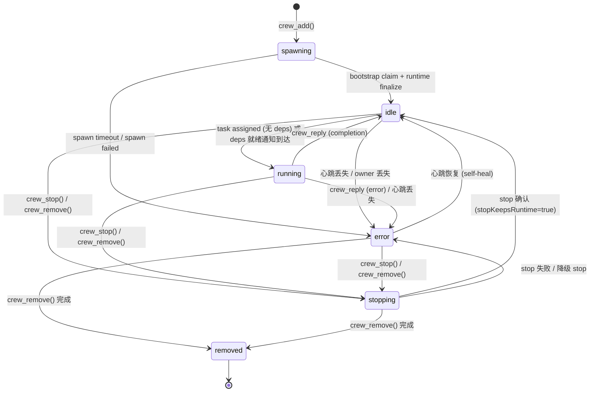
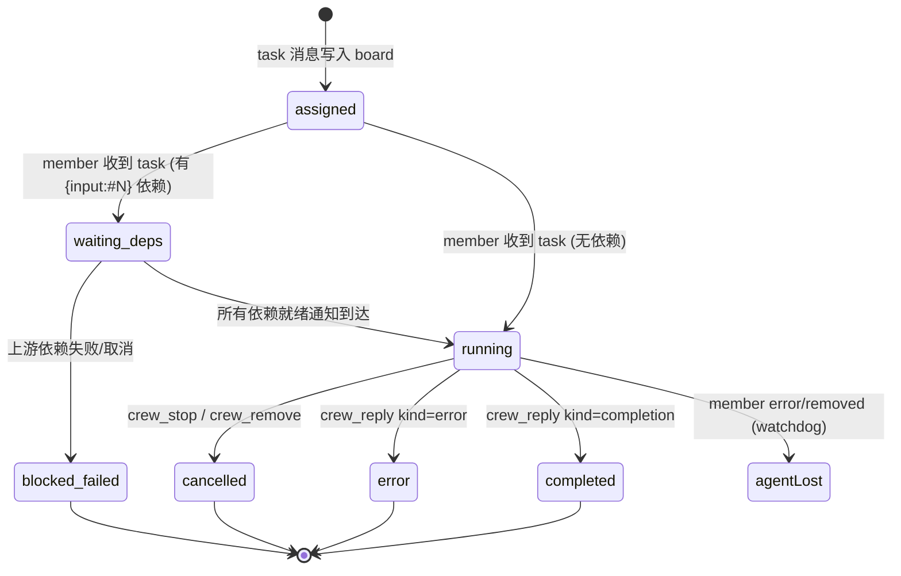

# Task 状态与 Member 状态分离设计

**Status:** Draft

> 目标：将 task 生命周期状态从 member 活跃度状态中分离，使依赖等待、聊天阻塞等中间状态可被自动推导和观测，同时不要求 agent 主动设置除 task 闭合之外的任何状态。

## 1. 现状与问题归纳

### 1.1 当前状态模型

```
Member state (RoomMemberLifecycleState):
  spawning → idle → running → stopping → error → removed

Task status (crew_tasks 推导):
  running → completed | error | cancelled | agentLost
```

**问题**：两个正交维度被压扁在一个状态机里。

### 1.2 核心症状

**症状 A — 依赖等待无法观测**

当 agentB 收到 taskB（含 `{input:#100}` 等待 agentA 的 taskA 完成），系统行为：

1. `applyIncomingMessageState` 将 `member.state` 立即设为 `running`（dispatch.ts:78）
2. 依赖系统仅在 task content 中追加文本注释告知 agent 等待，不修改任何状态
3. `crew_who` 显示 agentB 为 `running`，`crew_tasks` 显示 taskB 为 `running`——与 agentA 真正执行 taskA 时完全无法区分

实际时间线：

```
T1: taskA → agentA, taskB → agentB (含 {input:#100})
T2: agentA: running, agentB: running (但 agentB 实际在等待)
T3: agentA 完成 → deps 系统通知 agentB "All dependencies ready"
T4: agentB 开始执行 → agentB: running (和 T2 完全一样！)
```

**症状 B — `chatBusy` hack 的存在证实了混淆**

`crew_who`（tools.ts:1795）中有一行：

```typescript
const state = (member.chatBusy && member.state === "idle") 
    ? "running"   // 把 idle+chat 伪装成 running
    : member.state;
```

说明开发者已意识到需要一个"非 idle 也非 task-running"的中间态，但没有正式建模。

**症状 C — task 分配门槛用错了信号**

`assertTaskTargetAvailable`（storage.ts:1493）当前用三个 OR 条件拦截新 task：

```typescript
if (target.state === "running" || target.currentTaskMessageId || target.currentTask) {
    throw new MemberNotAvailableError(target.name, "already running a task");
}
```

`state === "running"` 这个条件过度拦截——如果 agent 因为聊天或其他原因处于 `running` 但并无未闭合 task，此时应当允许分配新 task。

### 1.3 根因

**Member state 同时承担了两个职责**：
- 进程活跃度（agent 是否存活、是否在运行）
- Task 执行进度（task 是否被分配、是否在执行）

当"task 被分配但未在执行"的中间状态出现时（依赖等待、用户对话），单一状态域无法表达。

## 2. 参考系统分析

### 2.1 Celery — Task 与 Worker 完全分离

```
Task state:  PENDING → RECEIVED → STARTED → SUCCESS/FAILURE/RETRY/REVOKED
Worker state: 独立心跳，active/offline
```

关键启示：`RECEIVED`（worker 收到但未开始）是 crew 缺失的关键状态。Celery 的 `STARTED` 是可选的（需 `task_track_started=True`），只在 worker 真正开始执行时才设置——这与 crew 的 `running` 应对齐。

### 2.2 Apache Airflow — 依赖阻塞有专门状态

```
Task instance:  none → scheduled → queued → running
                → deferred → queued  (等待外部触发器)
                → upstream_failed     (被上游拖垮)
```

两个直接可借鉴的状态：
- **`deferred`**：非终态、不在执行，等待外部条件满足后自动回到 `queued → running`——精确对应 crew 的 `waiting_deps`
- **`upstream_failed`**：终态但非自身失败，是被上游拖垮——对应"taskA error → taskB 的 deps 永不可能满足"

### 2.3 arXiv 2604.11378 — LLM Agent 调度器框架

论文定义的 agent node 状态：

```
Σ = {pending, ready, running, waiting_human, blocked, failed_retryable}
```

- `blocked` 精确映射 crew 的依赖等待
- `waiting_human` 对应 crew 的 `chatBusy` 场景
- `ready` 是一个显式过渡态——依赖就绪但尚未被调度执行

### 2.4 跨系统对比

| 概念 | Celery | Airflow | arXiv 2604 | crew 当前 | crew 目标 |
|------|--------|---------|-----------|---------|----------|
| 已创建/等待投递 | `PENDING` | `scheduled` | `pending` | ❌ | `assigned` |
| 已接收/等待开始 | `RECEIVED` | `queued` | `ready` | ❌ (直接 running) | `accepted` |
| 等待上游依赖 | — | **`deferred`** | **`blocked`** | ❌ (文本注释) | **`waiting_deps`** |
| 等待用户输入 | — | `up_for_reschedule` | **`waiting_human`** | ❌ (chatBusy hack) | **`waiting_user`** |
| 正在执行 | `STARTED` | `running` | `running` | `running` | `running` |
| 被上游拖垮 | — | **`upstream_failed`** | — | ❌ | **`blocked_failed`** |

## 3. 设计原则

1. **Agent 只负责闭合 task**。所有中间态由系统从已有信号自动推导，agent 不调新 tool、不设新状态。
2. **Member state 缩减语义为"进程活跃度"**。只回答"agent 是否存活/在工作"。Task 进度由 task 自身状态表达。
3. **Task 进度从已有信号推导**。不新增持久化字段，从 content 占位符（`{input:#N}`）、depIndex/taskStates（内存）、reply 消息三个信号实时计算。
4. **依赖等待的自动流转**。dep 就绪通知到达 → member state 自动从 `idle` → `running`，无需 agent 干预。
5. **Task 分配门槛只看 task 闭合状态**。不检查 `state`，只检查 `currentTaskMessageId`。

## 4. 详细设计

### 4.1 Member 状态语义重新定义

```
spawning  — agent 正在创建
idle      — agent 存活且不在执行 task（可能在聊天、等待 deps、或完全空闲）
running   — agent 正在执行一个已就绪的 task
stopping  — agent 正在被停止
error     — agent 异常
removed   — agent 已被移除
```

**关键变化**：`idle + currentTaskMessageId ≠ null` 成为一个合法且有语义的组合——"已接收 task，但因依赖未就绪而等待"。此前代码中不存在此组合（因为 task 一到就设 `running`）。

### 4.2 Task 状态推导逻辑（新增）

不持久化，纯从信号实时计算。定义在 `deriveTaskStatus()` 中，供 `crew_tasks` 和 `crew_who` 消费。

```
Derived Task Status:
  assigned       — task 消息已发出，member 尚未开始执行
  waiting_deps   — member 已收到 task，但 {input:#N} 依赖未全部就绪
  blocked_failed — 上游依赖已失败/取消，task 不可能执行
  running        — member 正在执行
  completed      — completion reply 已发出
  error          — error reply 已发出
  cancelled      — cancelled reply 已发出
  agentLost      — member 已 error/removed 且 task 未闭合
```

**推导规则**（伪代码）：

```typescript
function deriveTaskStatus(task, member, depState): TaskStatus {
    const reply = findTerminalReply(task.id);
    if (reply) return terminalStatusFromReply(reply);  // completed/error/cancelled

    if (!member || member.state === "removed" || member.state === "error") {
        if (member?.currentTaskMessageId !== task.id) return "agentLost";
    }

    const deps = extractInputDeps(task.content);
    if (deps.length > 0) {
        const { ready, hasCancelled, hasError } = depState;
        if (!ready && (hasCancelled || hasError)) return "blocked_failed";
        if (!ready) return "waiting_deps";
    }

    if (member.state === "idle" && member.currentTaskMessageId === task.id) {
        return "assigned";  // 已分配但 member 还没进入 running
    }

    return "running";
}
```

### 4.3 `crew_who` 推导逻辑改造

当前行（tools.ts:1795）：

```typescript
const state = (member.chatBusy && member.state === "idle") ? "running" : member.state;
```

改造为：

```typescript
function effectiveMemberDisplayState(member): string {
    // 1. 正在对话 → chatting（最高优先级，覆盖一切 idle 场景）
    //    不检查 currentTaskMessageId——即使有等待中的 task，对话期间仍显示 chatting。
    //    task 状态通过 crew_tasks 独立查看。
    if (member.chatBusy && member.state === "idle") {
        return "chatting";
    }
    // 2. 已接收 task，但在等 deps → waiting_deps
    if (member.state === "idle" && member.currentTaskMessageId) {
        const task = findTaskByMessageId(member.currentTaskMessageId);
        if (task && extractInputDeps(task.content).length > 0) {
            return "waiting_deps";
        }
        return "assigned";
    }
    // 3. 其他情况直接使用原始 state
    //    注意：chatBusy + state=running 仍显示 "running"，因为 agent 确实在执行 task
    return member.state;
}
```

### 4.4 依赖等待的自动状态流转

#### 改动点 1：`applyIncomingMessageState`（dispatch.ts:78）

```typescript
// 改造前
if (message.kind === "task") {
    return { ...member, state: "running", currentTask: message.summary, ... };
}

// 改造后
if (message.kind === "task") {
    const hasPendingDeps = extractInputDeps(message.content).length > 0;
    return {
        ...member,
        state: hasPendingDeps ? member.state : "running",  // 有依赖就不动
        currentTask: message.summary,
        currentTaskMessageId: message.id,
        lastError: null,
        taskClosureSteeredMessageId: null,
        todoProgress: null,
    };
}
```

#### 改动点 2：dep 就绪通知到达时自动转 `running`

在 `applyIncomingMessageState` 或 `processUnreadMessages` 中新增规则：

```typescript
// dep 就绪通知自动触发 member state 转换
if (message.kind === "info" 
    && message.from === "system" 
    && message.summary === `All dependencies ready for task #${member.currentTaskMessageId}`
    && member.state === "idle"
    && member.currentTaskMessageId) {
    return { ...member, state: "running" };
}
```

流程效果：

```
T1: agentB poll 收到 taskB → hasPendingDeps=true → state 保持 idle
T2: agentA 完成 → notifyDependentsIfAllReady → system → agentB "deps ready"
T3: agentB poll 收到 deps ready 通知 → state: idle → running (自动)
T4: processUnreadMessages 检测到 becameRunning → 自动发送 "Starting: taskB"
```

**Agent 全程无操作**。它只在看到 steer 消息后开始执行，最后 `crew_reply`。

#### 改动点 3：`appendMessage` 中 owner 侧的 state 写入（storage.ts:1623）

```typescript
// 改造前
await Promise.all(taskTargets.map(target =>
    writeRoomMemberState(roomDir, {
        ...target,
        state: target.state === "spawning" ? "spawning" : "running",
        currentTask: complete.summary,
        currentTaskMessageId: complete.id,
        ...
    })
));

// 改造后
await Promise.all(taskTargets.map(target => {
    const hasPendingDeps = extractInputDeps(complete.content).length > 0;
    const nextState = target.state === "spawning" ? "spawning"
        : hasPendingDeps ? target.state   // 有依赖就不动 state
        : "running";                       // 无依赖才设 running
    return writeRoomMemberState(roomDir, {
        ...target,
        state: nextState,
        currentTask: complete.summary,
        currentTaskMessageId: complete.id,
        ...
    });
}));
```

### 4.5 Task 分配门槛改造

#### 改动点 4：`assertTaskTargetAvailable`（storage.ts:1493）

```typescript
// 改造前
async function assertTaskTargetAvailable(roomDir: string, target: RoomMemberState): Promise<void> {
    if (target.state === "running" || target.currentTaskMessageId || target.currentTask) {
        throw new MemberNotAvailableError(target.name, "already running a task");
    }
    await assertDirectedTargetAvailable(roomDir, target, false);
}

// 改造后
async function assertTaskTargetAvailable(roomDir: string, target: RoomMemberState): Promise<void> {
    // 只要 agent 有未闭合的 task，就拒绝新 task 分配
    if (target.currentTaskMessageId || target.currentTask) {
        throw new MemberNotAvailableError(target.name, "already has an unclosed task");
    }
    await assertDirectedTargetAvailable(roomDir, target, false);
}
```

`state` 不再参与 gating。`assertDirectedTargetAvailable` 仍负责拦截 `stopping`/`removed`/stopped-tombstone/心跳丢失等进程级阻塞。

#### 分配矩阵

| 场景 | state | currentTaskMessageId | 能否接受新 task |
|------|-------|---------------------|:--:|
| agent 空闲 | idle | null | ✅ |
| agent 和用户聊天 | idle, chatBusy=true | null | ✅ |
| agent 已收到 task，等 deps | idle | set | ❌ |
| agent 正在执行 task | running | set | ❌ |
| agent 的 task error 闭合 | error | null | ❌（`assertDirectedTargetAvailable` 拦截 stopped tombstone / 心跳丢失）|
| agent 的 task 正常闭合 | idle | null | ✅ |

### 4.6 `crew_tasks` 推导逻辑改造（tools.ts:1831-1867）

```typescript
// 改造后 — 使用 deriveTaskStatus 替代当前逻辑
const resolved = await Promise.all(tasks.map(async (task) => {
    const reply = allMessages.find((m) =>
        m.replyTo === task.id && ["completion", "error", "cancelled"].includes(m.kind)
    );
    if (reply) {
        return {
            task,
            status: reply.kind === "completion" ? "completed"
                : reply.kind === "error" ? "error"
                : "cancelled",
            completedAt: reply.createdAt,
            todoProgress: null,
        };
    }

    const member = task.to !== "room"
        ? await loadRoomMemberState(activeRoom.roomDir, task.to).catch(() => null)
        : null;

    // agentLost 检查
    if (member
        && (member.state === "removed" || member.state === "error")
        && member.currentTaskMessageId !== task.id) {
        return { task, status: "agentLost", todoProgress: null, completedAt: null };
    }

    // 依赖状态推导
    const deps = extractInputDeps(task.content);
    if (deps.length > 0) {
        const { ready, hasCancelled, hasError } = await allDepsReady(activeRoom.roomDir, task.content);
        if (!ready && (hasCancelled || hasError)) {
            return { task, status: "blocked_failed", todoProgress: null, completedAt: null };
        }
        if (!ready) {
            return { task, status: "waiting_deps", todoProgress: member?.todoProgress ?? null, completedAt: null };
        }
    }

    // assigned vs running
    if (member && member.state === "idle" && member.currentTaskMessageId === task.id) {
        return { task, status: "assigned", todoProgress: member.todoProgress ?? null, completedAt: null };
    }

    return { task, status: "running", todoProgress: member?.todoProgress ?? null, completedAt: null };
}));
```

## 5. 完整状态机

### 5.1 Member 状态机（改造后）



**关键解释**：`idle` 现在有两种子状态：
- `idle + currentTaskMessageId == null` — 完全空闲，可接受新 task
- `idle + currentTaskMessageId != null` — 已接收 task 但因依赖未就绪在等待，不接受新 task

这两种子状态通过 `crew_who` 的 `effectiveMemberDisplayState` 区分为 "idle" 和 "waiting_deps/assigned"。

### 5.2 Task 状态推导流程



## 6. 改动清单

| # | 文件 | 函数/位置 | 改动 | 风险 |
|---|------|----------|------|------|
| 1 | `dispatch.ts:78-108` | `applyIncomingMessageState` | task 有 deps 时不设 `state: "running"` | 低 — 改前 member 侧 poll 时设 state |
| 2 | `dispatch.ts` | `applyIncomingMessageState`（新增规则） | dep 就绪通知到达时自动 `idle → running` | 低 — 新增规则，已有信号驱动 |
| 3 | `storage.ts:1623` | `appendMessage` 内 task target 写入 | 有 deps 时不设 `state: "running"` | 中 — owner 侧 push 设 state，需与 #1 一致 |
| 4 | `storage.ts:1493` | `assertTaskTargetAvailable` | 删除 `state === "running"` 条件 | 中 — 影响所有 task 分配路径（`crew_tell` task、`crew_add` 初始 task） |
| 5 | `tools.ts:1795` | `executeCrewWho` | 改造 `effectiveMemberDisplayState` 推导（chatBusy 优先级 > waiting_deps） | 低 — 仅影响展示 |
| 6 | `tools.ts:1831-1867` | `executeCrewTasks` | 使用依赖状态推导 task status | 中 — 引入 `allDepsReady` 调用，增加 `blocked_failed`/`waiting_deps`/`assigned` 输出 |
| 7 | `schemas.ts` | `CrewTasksSchema` | 扩展 `status` enum 增加 `assigned`、`waiting_deps`、`blocked_failed` | 低 — schema 扩展，向后兼容 |

## 7. 不做的

- **不新增持久化字段**。Task 状态保持纯推导，不写磁盘。这也意味着 `deriveTaskStatus` 在非 owner 进程中调用 `allDepsReady` 时会触发 `ensureRoomLoaded`（冷启动扫描），O(N) 唯一代价在首次调用。
- **不新增 `crew_reply` 的 kind**。agent 仍只使用 `completion`/`error`/`cancelled`。不引入 `accepted`/`waiting` 等中间态 kind。
- **不改 `RoomMemberLifecycleState` 的类型定义**。`idle`/`running` 语义改变通过推导层体现，类型本身不变——避免大规模代码改动。
- **不改 `chatBusy` 的底层机制**。`chatBusy` 仍由 `session_start`/`session_shutdown` 事件管理（index.ts），只在展示层（`crew_who`）改推导逻辑。

## 8. 测试要点

1. **依赖等待流转**：taskB 有 `{input:#100}`，taskA 未完成 → memberB state=idle, taskB status=waiting_deps；taskA 完成 → memberB 自动变 running
2. **gating**：agent 有未闭合 task（idle+currentTask）时，`crew_tell kind=task` 被拒绝；agent 无 task 但 state=running（不应存在，但防御性测试）时，允许分配
3. **blocked_failed**：taskA error → taskB status 从 waiting_deps 变为 blocked_failed
4. **无依赖 task 行为不变**：task 无 `{input:#N}` 时，member 收到后立即 running
5. **`crew_who` 展示**：waiting_deps 的 member 显示为 "waiting_deps" 而非 "running"；chatting 的 member 显示为 "chatting" 而非 "running"
6. **`crew_tasks` 新 status**：filter by `waiting_deps`、`blocked_failed`、`assigned` 正常工作
